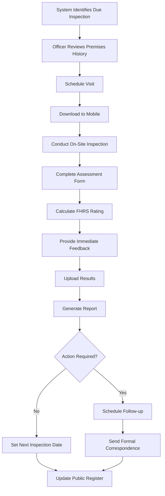
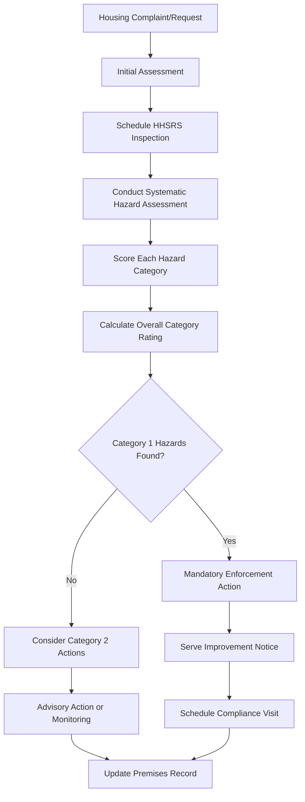
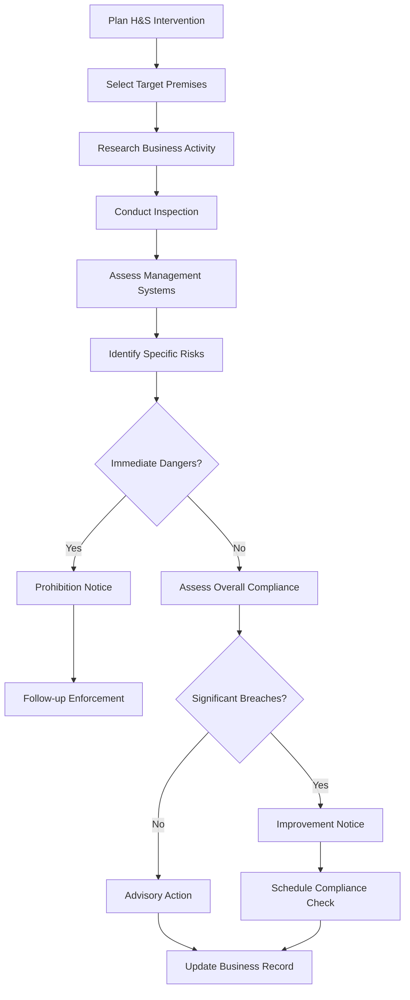

# Inspections Management 

## What This Module Does for You

**Your systematic approach to regulatory oversight:** The Inspections module in the Idox Public Protection System manages the complete inspection lifecycle across all service areas. Whether conducting food hygiene inspections, health and safety visits, housing assessments, or consumer protection checks - this module provides structured inspection forms, risk assessment tools, and compliance tracking.

**Why it matters to your daily work:** Every premises in the system has inspection records that build up a complete compliance history. The system calculates risk ratings, schedules inspections based on statutory requirements and risk levels, provides mobile inspection forms for field work, and automatically generates reports and certificates. All inspection data feeds into the broader regulatory intelligence about each premises.

**Key benefits:**
- **Risk-based prioritization** - Focus your time on the premises that need it most
- **Mobile-first approach** - Complete inspections entirely on your mobile device
- **Consistent methodology** - Standardized approaches ensure fair, defensible decisions
- **Automatic scheduling** - Never miss a due inspection or statutory deadline
- **Performance tracking** - See the impact of your regulatory work over time

## Quick Start Guide

### Your First Day with Inspections
1. **Access the module**: Click "Inspections" from the main navigation menu
2. **Review your homepage**: Check your homepage for inspection items due
3. **Understand inspection types**: Food, Health & Safety, Consumer Protection, Environmental Protection, etc.
4. **Learn to search**: Use the inspection search to find specific inspections or premises
5. **Explore inspection forms**: Review the different inspection templates available

### Essential Daily Tasks Checklist
- [ ] Check for overdue inspections requiring immediate attention
- [ ] Review today's scheduled inspections and prepare mobile device
- [ ] Upload yesterday's completed inspections from mobile
- [ ] Check any follow-up actions due from previous visits
- [ ] Update premises risk ratings based on latest findings

## Common Workflows

### Workflow 1: Routine Food Hygiene Inspection

#### Step-by-Step Process:

##### Step 1: Pre-Inspection Planning
- **Access inspection**: From premises record, click "Inspections" in left-hand menu
- **Review history**: Check previous inspection scores and any outstanding actions
- **Check intelligence**: Review any recent complaints or enforcement actions in the premises record
- **Risk factors**: Note any special considerations from premises history
- **Schedule visit**: Contact business to arrange suitable appointment time

##### Step 2: Mobile Preparation
- **Download inspection**: Inspections → Mobile → Sync Selected Inspections
- **Verify data**: Check premises details, contact information, previous scores
- **Prepare equipment**: Ensure mobile charged, camera working, thermometer calibrated
- **Route planning**: Use GPS integration to plan efficient travel route
- **Offline capability**: Inspections can be completed without internet connection
- **Print Forms**: Use 'Print Forms' button if updating on mobile/laptop offline

##### Step 3: On-Site Inspection
- **Arrival procedure**: Note arrival time, identify manager or responsible person
- **Opening discussion**: Explain purpose, show ID, discuss previous visit outcomes
- **Systematic assessment**: Follow inspection checklist using appropriate form:
  - **Food hygiene**: Temperature controls, cleaning, pest control
  - **Structure**: Condition of building, equipment, water supply
  - **Confidence**: Management systems, training, food safety management
- **Scoring**: Enter scores for each section of the inspection
- **Evidence gathering**: Take photos of any non-compliance issues
- **Temperature recording**: Log critical temperature readings where applicable

##### Step 4: Assessment Completion
- **Calculate rating**: Complete all sections and calculate overall score
- **Review findings**: Check all sections completed, verify overall assessment
- **Determine actions**: Note any follow-up actions required
- **Schedule follow-up**: If required, arrange return visit date
- **Manager discussion**: Provide verbal feedback on findings and any actions required

##### Step 5: Post-Inspection Actions
- **Complete inspection record**: Ensure all fields completed and saved
- **Generate documents**: Create inspection report and any certificates required
- **Communication**: Send report to business as per local procedures
- **Update premises**: Inspection results update the premises compliance record
- **Set next inspection**: System calculates next due date based on risk and inspection outcome

### Workflow 2: Housing Health and Safety Assessment (HHSRS)

#### Step-by-Step HHSRS Process:

##### Step 1: Request Assessment and Planning
- **Trigger identification**: Complaint, proactive program, or license application
- **Initial triage**: Determine if full HHSRS assessment needed
- **Appointment scheduling**: Arrange suitable time with occupant and landlord
- **Preparation**: Download HHSRS mobile forms, review property type guidance

##### Step 2: Comprehensive Property Assessment (Mobile)
- **Systematic inspection**: Assess all 29 HHSRS hazard categories:
  - **Physiological**: Dampness, excess heat/cold, noise, lighting
  - **Psychological**: Space, security, overcrowding
  - **Protection against infection**: Water supply, drainage, hygiene
  - **Protection against accidents**: Falls, burns, cuts, structural collapse
- **Evidence documentation**: Photos of each identified hazard
- **Occupant interview**: Health impacts, vulnerable occupants, duration of problems

##### Step 3: Hazard Scoring and Risk Calculation
- **Individual hazard scoring**: Rate likelihood and severity for each hazard
- **Vulnerable groups**: Consider children, elderly, disabled occupants
- **Calculate Category ratings**: System determines Category 1 (serious) vs Category 2 (other)
- **Priority ranking**: System ranks hazards by severity for action planning
- **Legal requirements**: Category 1 hazards trigger mandatory enforcement

##### Step 4: Action Determination and Implementation
- **Enforcement decision**: System guides appropriate action based on hazard categories
- **Notice preparation**: Generate improvement notices with specific requirements
- **Timescale setting**: Reasonable periods for compliance based on hazard severity
- **Cost considerations**: Assess reasonableness of required works
- **Appeal rights**: Ensure proper legal process followed

### Workflow 3: Health and Safety Workplace Inspection

#### Step-by-Step H&S Inspection Process:

##### Step 1: Target Selection and Research
- **Risk-based targeting**: Select premises based on accident data, complaints, national priorities
- **Business intelligence**: Research business activities, employee numbers, previous history
- **Regulatory framework**: Identify applicable H&S legislation and guidance
- **Visit planning**: Consider announced vs unannounced approach

##### Step 2: Systematic Workplace Assessment
- **Management systems**: Review H&S policies, risk assessments, training records
- **Physical hazards**: Machinery guarding, electrical safety, manual handling
- **Health hazards**: Chemical exposure, noise, dust, workplace stress
- **Employee consultation**: Interview workers about H&S concerns and training
- **Documentation review**: Check accident records, maintenance logs, competent person arrangements

##### Step 3: Compliance Assessment and Action Planning
- **Breach identification**: Document specific legal contraventions
- **Risk evaluation**: Assess likelihood and severity of potential harm
- **Immediate dangers**: Identify situations requiring immediate action
- **Improvement opportunities**: Note areas for business development
- **Proportionate response**: Match enforcement action to risk and business circumstances

## Real-World Scenarios

### Scenario 1: "The Challenging Food Business Inspection"

**Situation**: You arrive for a routine inspection at a busy restaurant but the manager claims to be "too busy to be inspected" and asks you to come back later.

**Your response approach:**
1. **Remain professional**: Explain your statutory right of entry and inspection duty
2. **Offer flexibility**: "I can wait a few minutes for service to calm down, but I do need to inspect today"
3. **Use mobile system**: Show appointment confirmation and legal authority
4. **Document refusal**: If access still refused, record details for potential enforcement
5. **Follow-up process**: Return with formal notice of intention if necessary

**Mobile system support:**
- Quick access to legal powers reference
- Real-time documentation of refusal
- Automatic generation of follow-up appointments
- Integration with enforcement module if needed

### Scenario 2: "The Category 1 Housing Hazard Discovery"

**Situation**: During what should be a routine housing inspection, you discover severe structural damage that poses immediate risk of collapse.

**Your immediate action protocol:**
1. **Safety first**: Ensure immediate area is evacuated
2. **Mobile recording**: Use emergency hazard recording function
3. **Immediate photos**: Document evidence of imminent danger
4. **Emergency contacts**: Use system to contact building control, emergency housing
5. **Prohibition action**: Serve emergency prohibition notice using mobile forms
6. **Follow-up coordination**: Coordinate with housing team for emergency accommodation

**System features used:**
- Emergency hazard classification
- Instant prohibition notice generation
- Multi-agency notification system
- Emergency contact database integration

### Scenario 3: "The Multi-Issue Workplace Visit"

**Situation**: Health and safety inspection at a small engineering workshop reveals multiple serious issues: unguarded machinery, electrical hazards, and poor manual handling practices.

**Your systematic approach:**
1. **Prioritize immediate dangers**: Address unguarded machinery first
2. **Systematic documentation**: Use H&S mobile checklist for comprehensive recording
3. **Evidence gathering**: Photos of each hazard with safety measurements
4. **Management interview**: Discuss company H&S arrangements and competence
5. **Action planning**: Multiple improvement notice requirements coordinated
6. **Support offering**: Provide guidance on finding competent H&S advice

**Cross-module integration:**
- Link to business premises record for compliance history
- Check licensing requirements for industrial activities
- Coordinate with fire safety teams if needed
- Schedule follow-up visits based on notice compliance dates

## Integration with Other Modules

### How Inspections Connect to Your Broader Work

```mermaid
graph LR
    A[👤 Inspector] --> B[🔍 Inspections Module]
    B --> C[🏢 Premises Records]
    B --> D[📞 Complaints]
    B --> E[📋 Licensing]
    B --> F[⚖️ Enforcement]
    B --> G[📊 Risk Assessment]
    
    C -->|Premises history informs inspection approach| B
    D -->|Complaints trigger reactive inspections| B
    E -->|License conditions monitored during inspections| B
    F -->|Poor inspections trigger enforcement action| B
    G -->|Risk ratings determine inspection frequency| B
```

#### Premises Integration
- **Historical context**: Every inspection builds on previous visit findings
- **Risk calculation**: Inspection outcomes automatically adjust premises risk ratings
- **Intelligence building**: Patterns across inspections identify systemic issues
- **Compliance tracking**: Long-term compliance trends inform regulatory approach

#### Complaints Integration
- **Triggered inspections**: Serious complaints automatically generate inspection requirements
- **Evidence correlation**: Inspection findings confirm or contradict complaint allegations
- **Pattern recognition**: Repeated complaints validated through systematic inspection
- **Complainant feedback**: Inspection outcomes provide resolution to original complaints

#### Licensing Integration
- **Condition monitoring**: License conditions become inspection checklist items
- **Application assessment**: Pre-licensing inspections inform application decisions
- **Compliance tracking**: Ongoing inspection results affect license renewals
- **Enforcement triggers**: Poor compliance may trigger license reviews

#### Enforcement Integration
- **Evidence gathering**: Inspection findings provide evidence for formal action
- **Graduated response**: Inspection scores determine appropriate enforcement level
- **Compliance monitoring**: Post-enforcement inspections verify improvement
- **Legal defensibility**: Systematic inspection records support prosecution cases

#### Mobile Working Integration
- **Offline capability**: Complete inspections without internet connectivity
- **Real-time synchronization**: Instant upload of completed inspections
- **GPS verification**: Automatic location confirmation for audit purposes
- **Equipment integration**: Camera, thermometer, and measurement tool connectivity

## Troubleshooting

### Common Issue 1: "Mobile inspection won't sync back to main system"

**Problem**: Completed inspection stuck on mobile device
**Diagnosis steps**:
- Check internet connectivity
- Verify all mandatory fields completed
- Look for photo upload issues
- Check system storage space

**Solutions**:
1. **Force sync**: Mobile → Settings → Force Upload
2. **Check completeness**: Review inspection for missing mandatory information
3. **Photo management**: Compress or remove oversized photos
4. **Manual backup**: Export inspection data as backup before retry
5. **IT support**: Contact system administrator if persistent issues

### Common Issue 2: "Can't access premises for inspection"

**Problem**: Business refuses entry or repeatedly unavailable
**Diagnosis**:
- Check appointment confirmations sent
- Verify business operating hours
- Review any access restrictions noted
- Consider if formal powers needed

**Solutions**:
1. **Flexible scheduling**: Offer alternative times including early morning/evening
2. **Formal notice**: Serve notice of intention to inspect
3. **Legal powers**: Use statutory powers of entry where applicable
4. **Document attempts**: Record all access attempts for enforcement consideration
5. **Manager involvement**: Escalate persistent access refusal to team leader

### Common Issue 3: "Inspection scores seem inconsistent"

**Problem**: Similar premises getting different ratings from different officers
**Diagnosis**:
- Review scoring criteria and guidance
- Check for local policy variations
- Consider premises-specific factors
- Review officer training and competency

**Solutions**:
1. **Calibration exercise**: Team reviews same premises and compares scoring
2. **Guidance review**: Update local guidance for consistency
3. **Peer assessment**: Shadow experienced colleagues for consistency checking
4. **Management review**: Team leader review of borderline cases
5. **Training update**: Additional training on consistent application of standards

### Common Issue 4: "System calculating wrong next inspection date"

**Problem**: Inspection frequencies don't match risk assessment outcomes
**Diagnosis**:
- Check risk calculation inputs
- Verify inspection type correctly recorded
- Review any manual overrides applied
- Check for system configuration issues

**Solutions**:
1. **Risk review**: Manually review and recalculate risk assessment
2. **Inspection classification**: Verify inspection recorded with correct type
3. **Override consideration**: Apply manual override if system calculation inappropriate
4. **Configuration check**: Contact administrator to verify calculation rules
5. **Documentation**: Record reasons for any manual interventions

### Common Issue 5: "Accident recording during inspection"

**Problem**: Accident occurs during inspection or needs to be recorded as part of investigation
**Process**:
- **Immediate safety**: Ensure injured person receives appropriate care
- **Accident module**: Create accident record linked to premises
- **RIDDOR assessment**: Determine if accident is RIDDOR reportable
- **Link to inspection**: Connect accident record to inspection via left-hand menu
- **Investigation**: Complete accident investigation as part of inspection follow-up

**Accident record fields**:
- **Premise Name**: Search and link to premises where accident occurred
- **Accident Date/Time**: Record precise date and time (24-hour format)
- **Date Reported**: When accident was reported to authority
- **Employee/Public**: Whether accident involved employee or member of public
- **Injury Category**: Type and severity of injury
- **Reportable**: Whether accident meets RIDDOR criteria
- **Name of Injured**: Link to contact record for injured person

## Tips and Best Practices

### Inspection Efficiency Strategies
- **Batch similar premises**: Group similar business types for consistent approach
- **Geographic clustering**: Plan routes to minimize travel time between visits
- **Peak time avoidance**: Schedule during quieter business periods where possible
- **Preparation discipline**: Always review premises history before visiting
- **Equipment readiness**: Maintain inspection equipment in good working order

### Quality Assurance Approaches
- **Consistent methodology**: Use system checklists to ensure nothing missed
- **Evidence documentation**: Always photograph non-compliance for clarity
- **Clear communication**: Explain findings and requirements clearly to businesses
- **Proportionate action**: Match response to actual risk rather than technical breach
- **Legal defensibility**: Document decisions thoroughly for potential appeals

### Professional Development
- **Stay current**: Keep up with legislative and guidance changes
- **Peer learning**: Share challenging cases with colleagues for collective learning
- **Continuous improvement**: Reflect on inspection outcomes for learning opportunities
- **Competency maintenance**: Complete required training and assessment updates
- **Performance monitoring**: Track your inspection outcomes for consistency

### Sample Collection During Inspections
- **Sample integration**: Samples can be created directly from inspection records
- **Automatic linking**: Samples created via inspections link to both inspection and premises
- **Sample viewing**: Use Samples left-hand menu to view samples taken during inspection
- **Recommendation**: Always create samples through inspections rather than separate Samples module

## FAQ

### Q: How do I access inspection forms on mobile?
**A**: Use the mobile app to download inspection packages before field work. Forms are available offline once downloaded.

### Q: Can I modify inspection scores after saving?
**A**: Yes, you can edit inspection records before final submission. Once submitted, contact your system administrator for any corrections.

### Q: How do I attach photos to inspection records?
**A**: Use the camera function in the mobile app during inspections. Photos are automatically GPS-tagged and linked to the inspection record.

### Q: What happens if I lose connection during an inspection?
**A**: The mobile app saves data locally. Complete the inspection offline and sync when connection is restored.

### Q: How do I generate inspection reports?
**A**: Complete all required fields in the inspection form and click "Generate Report". The system creates a professional report automatically.

---
