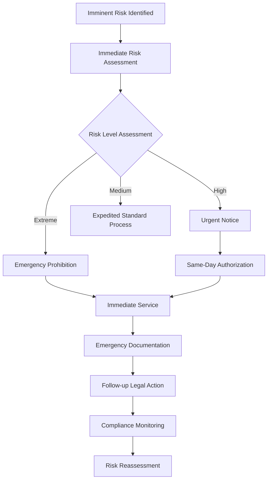

# Enforcement Management 

## What This Module Does for You

**Your formal enforcement system:** The Enforcement module in the Idox Public Protection System manages formal regulatory enforcement actions including statutory notices, prosecutions, and compliance monitoring. It provides structured workflows to ensure all enforcement actions are legally compliant and properly documented.

**Why it matters to your regulatory work:** This module ensures that formal enforcement actions follow correct legal procedures, maintain proper audit trails, and support successful prosecution cases. It helps you move from informal advice to formal action when voluntary compliance cannot be achieved.

**Key benefits:**
- **Structured enforcement** - Systematic approach to formal regulatory action
- **Legal documentation** - Proper recording of all enforcement activities
- **Case management** - Complete tracking of enforcement cases from start to finish
- **Compliance monitoring** - Track compliance with served notices and orders
- **Evidence preservation** - Secure storage of all enforcement evidence and documentation

## Quick Start Guide

### Your First Day with Enforcement
1. **Access the module**: Click "Enforcement" from the main navigation menu
2. **Learn the interface**: Understand how to create, manage, and track enforcement cases
3. **Review enforcement types**: Familiarize yourself with different types of enforcement actions available
4. **Check assigned cases**: Review any enforcement cases assigned to you
5. **Understand procedures**: Learn the basic enforcement workflow and authorization requirements

### Essential Daily Tasks Checklist
- [ ] Review enforcement cases assigned to you requiring action
- [ ] Check compliance deadlines for any notices served
- [ ] Update enforcement case records with latest developments
- [ ] Monitor prosecution cases for court dates and requirements
- [ ] Complete any outstanding enforcement documentation

## Common Workflows

### Workflow 1: Serving a Statutory Notice

#### Step-by-Step Process:

##### Step 1: Enforcement Assessment
- **Create enforcement case**: Access Enforcement module and create new enforcement case
- **Link to trigger**: Link enforcement case to the inspection or complaint that identified breaches
- **Review evidence**: Assess the evidence available to support enforcement action
- **Select enforcement type**: Choose appropriate type of notice or action based on breaches found
- **Check authorization**: Determine what level of authorization is required

##### Step 2: Notice Preparation
- **Create notice record**: Access Notices module or use left-hand menu from premises/inspection
- **Notice details**: Complete notice fields:
  - **Served Against**: Premises, Contact, Licence, Inspection, or Vehicle
  - **Notice Group/Type**: Select from configured notice categories
  - **Notice Classification**: Classification as defined in Admin
  - **Served On Contact**: Select from premises contacts (Owner, Occupier, Additional)
  - **Manual Reference**: Optional manual reference number
- **Service details**:
  - **Served by Officer**: Officer serving the notice
  - **How Served**: Method of service (personal, post, etc.)
  - **Royal Mail Ref**: Postal service reference if applicable
- **Compliance dates**:
  - **Served on Date**: Date notice served
  - **Works Commencement Date**: When works must start
  - **Works Complete**: When works must be completed
  - **Appeal By Date**: Deadline for appeals
- **Content details**:
  - **Officer Statement**: Detailed officer observations
  - **Date/Time of Offence**: When contraventions observed
  - **Offence**: Specific details of contraventions
  - **Notes**: Additional relevant information

##### Step 3: Authorization and Approval
- **Submit for authorization**: Send notice for appropriate management approval
- **Provide supporting evidence**: Include all relevant documentation and evidence
- **Address any queries**: Respond to any questions from authorizing officer
- **Make amendments**: Revise notice if required following review
- **Obtain final approval**: Receive authorization to serve the notice

##### Step 4: Notice Service
- **Arrange service**: Plan how and when to serve the notice
- **Serve notice**: Deliver notice to responsible person using appropriate method
- **Record service**: Document service details including date, time, method, and person served
- **Provide copy**: Ensure recipient receives copy of notice and understands requirements
- **Set monitoring**: Establish compliance monitoring schedule

### Workflow 2: Building a Prosecution Case

#### Step-by-Step Prosecution Process:

##### Step 1: Prosecution Assessment
- **Navigate to**: Enforcement → New Case → Prosecution
- **Evidential test**: Assess if evidence meets "realistic prospect of conviction" test
- **Public interest test**: Consider public interest factors in prosecution
- **Legal framework**: Identify specific offences and maximum penalties
- **Defendant assessment**: Consider defendant's circumstances and previous record

##### Step 2: Evidence Collection and Organization
- **Primary evidence**: Gather all direct evidence of offences
- **Officer statements**: Prepare detailed witness statements from investigating officers
- **Expert evidence**: Obtain technical expert opinions where required
- **Document chain**: Ensure all evidence has proper continuity records
- **Disclosure preparation**: Identify and schedule unused material

**Evidence checklist for food safety prosecution**:
- **Inspection reports**: Detailed documentation of contraventions found
- **Photographs**: Clear images of poor conditions/practices
- **Temperature records**: Evidence of temperature control failures
- **Officer observations**: Professional witness statements
- **Business records**: Cleaning schedules, training records, supplier details
- **Previous history**: Compliance record and any previous enforcement

##### Step 3: Case File Assembly
- **Prosecution file**: System generates structured case file for legal review
- **Summary of evidence**: Overview of case against each defendant
- **Sentencing factors**: Aggravating and mitigating circumstances
- **Costs calculation**: Estimated prosecution costs for recovery
- **Victim impact**: Consider impact on complainants or wider public

##### Step 4: Legal Review and Authorization
- **Legal assessment**: Internal or external legal review of case strength
- **Senior authorization**: Obtain required authority for prosecution (usually service manager level)
- **Budget approval**: Confirm budget availability for prosecution costs
- **Court preparation**: Book initial court hearing and serve papers

##### Step 5: Court Process Management
- **Court liaison**: Maintain regular contact with legal representatives
- **Witness preparation**: Brief officers who will give evidence
- **Evidence presentation**: Organize evidence for court presentation
- **Outcome recording**: Record court decision, sentence, and any orders made
- **Costs recovery**: Pursue awarded costs through appropriate procedures

### Workflow 3: Emergency Enforcement Action

#### Emergency Action Protocol:

##### Step 1: Immediate Risk Assessment
- **Risk evaluation**: Assess immediate threat to public health/safety
- **Emergency powers**: Determine if emergency powers apply
- **Evidence gathering**: Document immediate risks with photos/notes
- **Communication**: Inform supervisor of emergency situation
- **Legal framework**: Confirm appropriate emergency powers

##### Step 2: Emergency Action Implementation
- **Mobile emergency form**: Use mobile device to prepare emergency notice
- **Immediate service**: Serve emergency notice on responsible person
- **Clear instructions**: Explain immediate actions required
- **Evidence preservation**: Secure evidence before site conditions change
- **Safety measures**: Ensure immediate risks are addressed

##### Step 3: Post-Emergency Procedures
- **Full documentation**: Complete detailed case file promptly
- **Authorization validation**: Obtain retrospective senior authorization if required
- **Legal compliance**: Ensure all procedural requirements met
- **Follow-up planning**: Schedule compliance check and next steps
- **Communication**: Inform relevant stakeholders of action taken

## Real-World Scenarios

### Scenario 1: "The Non-Compliant Restaurant Notice"

**Situation**: You served a Food Safety Improvement Notice for serious hygiene issues. The compliance deadline has arrived and you're conducting a follow-up visit.

**Your assessment approach:**
1. **Pre-visit preparation**: Review original notice requirements item by item
2. **Systematic compliance check**: Assess each required improvement against current conditions
3. **Evidence documentation**: Photo evidence of improvements made (or not made)
4. **Partial compliance evaluation**: Determine if partial improvements affect enforcement options
5. **Next steps decision**: Full compliance, partial compliance, or complete non-compliance

**System workflow:**
- **Compliance monitoring**: Enforcement → Compliance Check → Select Notice
- **Evidence comparison**: Compare current photos with original breach evidence
- **Compliance scoring**: System tracks percentage compliance with each requirement
- **Decision recording**: Document assessment and next enforcement steps
- **Automatic scheduling**: System schedules next compliance check or escalation

**Possible outcomes and actions:**
- **Full compliance**: Close case, remove from monitoring, send confirmation letter
- **Good progress**: Extend deadline with partial compliance letter, schedule final check
- **Poor compliance**: Consider prosecution for non-compliance with notice
- **No compliance**: Immediate prosecution preparation and potential emergency action

### Scenario 2: "The Urgent Housing Hazard"

**Situation**: During a housing inspection, you discover a Category 1 hazard requiring immediate improvement notice, but it's 4:30 PM on Friday and the landlord is claiming they can't do anything until next week.

**Your emergency response:**
1. **Immediate hazard assessment**: Document specific risks to occupants
2. **Emergency powers consideration**: Determine if emergency notice powers apply
3. **Resident safety**: Ensure immediate safety of vulnerable occupants
4. **Out-of-hours authorization**: Contact senior officer for emergency approval
5. **Service and documentation**: Serve notice and complete documentation

**Key enforcement considerations:**
- **Hazard severity**: Category 1 hazards require mandatory enforcement action
- **Resident vulnerability**: Consider elderly, disabled, or child occupants
- **Seasonal factors**: Cold weather, heating failures increase urgency
- **Alternative accommodation**: May need to involve housing team for emergency housing

### Scenario 3: "The Repeat Offender Prosecution"

**Situation**: Same business has now breached three improvement notices in 2 years. Previous informal and formal action has failed. Management claims "economic hardship" as reason for non-compliance.

**Your prosecution strategy:**
1. **Pattern documentation**: Demonstrate systematic non-compliance over time
2. **Economic argument counter**: Show non-compliance is choice, not necessity
3. **Public interest factors**: Emphasize protection of customers and fair competition
4. **Sentencing factors**: Identify aggravating features for court consideration
5. **Compliance focus**: Prosecution aimed at achieving compliance, not punishment

**Evidence package for repeat offender**:
- **Compliance history**: Complete record of all enforcement actions
- **Pattern analysis**: Show escalating enforcement response and continued breaches
- **Economic assessment**: Evidence business can afford compliance (e.g., recent investments)
- **Public impact**: Document customer complaints, health impacts, competitor disadvantage
- **Deterrent value**: Explain importance of consistent enforcement for sector compliance

## Integration with Other Modules

### How Enforcement Connects to Your Complete Regulatory Approach

```mermaid
graph LR
    A[👤 Enforcement Officer] --> B[⚖️ Enforcement Module]
    B --> C[🔍 Inspections]
    B --> D[📞 Complaints]
    B --> E[🏢 Premises]
    B --> F[📋 Licensing]
    B --> G[📊 Case Management]
    
    C -->|Poor inspection results trigger enforcement| B
    D -->|Serious complaints lead to formal action| B
    E -->|Premises history informs enforcement approach| B
    F -->|License breaches may require enforcement| B
    G -->|Enforcement outcomes tracked for performance| B
```

#### Inspections Integration
- **Enforcement triggers**: Poor inspection scores automatically flag for enforcement consideration
- **Evidence provision**: Inspection reports and photos become prosecution evidence
- **Compliance monitoring**: Post-enforcement inspections verify improvement
- **Risk reassessment**: Enforcement outcomes affect premises risk ratings

#### Complaints Integration
- **Serious complaint escalation**: Formal complaints may bypass informal action
- **Evidence correlation**: Complaint evidence supports enforcement case
- **Public interest factors**: Multiple complaints demonstrate public concern
- **Resolution tracking**: Enforcement action resolves underlying complaint issues

#### Premises Integration
- **Historical context**: Premises compliance history informs enforcement decisions
- **Pattern recognition**: Systematic problems across multiple premises of same operator
- **Risk classification**: Enforcement action affects premises risk assessment
- **Intelligence building**: Enforcement outcomes inform future regulatory approach

#### Licensing Integration
- **Condition enforcement**: License condition breaches trigger formal action
- **Review implications**: Serious enforcement may lead to license review
- **Coordinated approach**: Align enforcement action with licensing consequences
- **Compliance evidence**: Enforcement outcomes considered in license renewals

## Troubleshooting

### Common Issue 1: "Notice served but no improvement achieved"

**Problem**: Compliance deadline passed but business hasn't made required improvements
**Assessment steps**:
- Review each notice requirement against current conditions
- Document exactly what has/hasn't been achieved
- Consider reasonable excuse for non-compliance
- Assess if partial compliance affects next steps

**Solutions**:
1. **Prosecution preparation**: Begin immediate prosecution for notice non-compliance
2. **Emergency powers**: Consider if continuing breach creates immediate risk
3. **Extension consideration**: Only if exceptional circumstances and good faith effort
4. **Alternative action**: Consider works in default if premises-based improvements
5. **Escalation**: Discuss complex cases with senior officers and legal team

### Common Issue 2: "Defendant claiming notice was not received"

**Problem**: Legal challenge based on alleged non-service of enforcement notice
**Evidence requirements**:
- Detailed service records including date, time, method, person served
- Proof of service documentation (signatures, postal receipts)
- Photos or other evidence of service location
- Officer statements confirming service details

**Prevention strategies**:
1. **Service method selection**: Use most reliable method for important notices
2. **Documentation discipline**: Record service details immediately and thoroughly
3. **Alternative service**: Use multiple service methods for important cases
4. **Photographic evidence**: Photo service location and any posted notices
5. **Witness service**: Use colleague witnesses for contentious cases

### Common Issue 3: "Authorization delays affecting enforcement timescales"

**Problem**: Enforcement action delayed while awaiting management authorization
**Process optimization**:
- Plan authorization timeline into enforcement timescales
- Provide complete case information for faster review
- Use urgent authorization procedures for time-critical cases
- Maintain dialogue with authorizing officers about progress

**Solutions**:
1. **Early engagement**: Discuss complex cases with managers before formal submission
2. **Complete submissions**: Ensure all required information provided initially
3. **Urgent procedures**: Use expedited authorization for emergency situations
4. **Delegation review**: Consider if delegation levels appropriate for case types
5. **Planning ahead**: Build authorization time into enforcement timelines

### Common Issue 4: "Prosecution case collapses due to evidence problems"

**Problem**: Court case fails due to inadequate or inadmissible evidence
**Prevention strategies**:
- Early legal review of evidence quality
- Proper evidence continuity and chain of custody
- Technical evidence review by specialists
- Witness statement quality and availability
- Disclosure compliance and unused material schedules

**Recovery actions**:
1. **Case review**: Understand why case failed and prevent recurrence
2. **Training needs**: Address officer competencies in evidence gathering
3. **Process improvement**: Review and update evidence handling procedures
4. **Alternative action**: Consider civil enforcement or administrative penalties
5. **Learning dissemination**: Share lessons learned with enforcement team

## Tips and Best Practices

### Notice Management Features
- **Batch printing**: Use Batch Print function to print multiple notices at once
- **Batch print reminders**: Print reminder notices for those approaching deadlines
- **Notice templates**: Use configured communication templates for consistent notices
- **Saved searches**: Save frequently used notice search criteria
- **Notice overview**: Use Notices Overview homepage for quick status view
- **Online payments**: Configure online payment for fixed penalty notices (if available)
- **Public portal**: Configure notices for public viewing with document redaction

### Legal Compliance Excellence
- **Procedural correctness**: Every enforcement action must follow exact legal procedures
- **Evidence quality**: Focus on admissible, relevant, and reliable evidence
- **Clear documentation**: Assume every document will be scrutinized in court
- **Authorization discipline**: Always obtain proper authority before action
- **Appeal readiness**: Prepare every case as if it will be legally challenged

### Effective Enforcement Strategy
- **Graduated response**: Escalate enforcement proportionately to risk and non-compliance
- **Consistency**: Treat similar cases similarly while considering individual circumstances
- **Communication**: Clear explanation of requirements and consequences
- **Compliance focus**: Aim for compliance achievement rather than punishment
- **Deterrent effect**: Consider broader impact of enforcement decisions

### Professional Standards
- **Impartiality**: Enforce law consistently regardless of personal views
- **Proportionality**: Match enforcement response to actual risk and harm
- **Transparency**: Clear communication about enforcement policies and decisions
- **Accountability**: Document decisions thoroughly for later scrutiny
- **Continuous learning**: Stay current with legal developments and case law

## FAQ

### Q: How do I create a new enforcement case?
**A**: Access the Enforcement module and use "New Case" to create enforcement records. Select the appropriate enforcement type and link to the originating inspection or complaint.

### Q: Can I link enforcement actions to multiple premises?
**A**: Yes, enforcement actions can be linked to premises, contacts, licenses, or inspections depending on the enforcement type and circumstances.

### Q: How do I generate enforcement notices?
**A**: Use the notice templates in the system. Select the appropriate notice type and complete all required fields. Submit for authorization before serving.

### Q: What happens if I need to modify a notice after creation?
**A**: You can edit notices before they are served. Once served, contact your system administrator for any corrections.

### Q: How do I track compliance with enforcement notices?
**A**: Use the compliance monitoring features to record follow-up visits and compliance status. The system tracks deadlines and compliance outcomes.

### Q: Can I export enforcement case data?
**A**: Yes, use the search and export functions to download enforcement data for reporting purposes.

### Q: How do I link enforcement to prosecution cases?
**A**: Use the prosecution integration features to create prosecution records from enforcement actions when required.

### Q: What if I need to extend a compliance deadline?
**A**: Use the system's deadline extension features to modify compliance dates with appropriate authorization and documentation.

---
