# Mobile Working 

## What This Module Does for You

**Your field work companion:** Mobile Working in the Idox Public Protection System enables you to access system functionality while working in the field. Whether you're conducting inspections, investigating complaints, or visiting premises, you can access and update system records using mobile devices.

**Why it matters to your field effectiveness:** Mobile access means you can review premises history before visits, update records in real-time during inspections, and access reference materials when needed. This reduces paperwork, improves data accuracy, and enables more efficient field operations.

**Key benefits:**
- **Field access** - Access system records and functionality while away from the office
- **Real-time updates** - Update records immediately during field visits
- **Reduced paperwork** - Eliminate need for paper forms and manual data entry
- **Improved accuracy** - Reduce errors by entering data directly into the system
- **Enhanced efficiency** - Complete more work in the field without office returns

## Quick Start Guide

### Your First Day with Mobile Working
1. **Download and setup**: Install mobile app and complete initial synchronization
2. **Test offline capability**: Ensure essential data is cached locally
3. **Familiarize with navigation**: Practice using GPS and map features
4. **Test evidence capture**: Try photo, signature, and audio recording features
5. **Complete a simple task**: Start with a straightforward inspection or compliance check

### Essential Daily Startup Checklist
- [ ] Sync device with latest work assignments and data updates
- [ ] Check battery level and bring portable charger if needed
- [ ] Verify GPS functionality and map data availability
- [ ] Review daily schedule and optimize route
- [ ] Ensure adequate device storage for photos and documents

## Common Workflows

### Workflow 1: Complete Mobile Inspection

#### Step-by-Step Mobile Inspection Process:

##### Step 1: Inspection Preparation
- **Access work list**: Mobile app → Today's Tasks → Select inspection
- **Download inspection package**: System preloads premises history, previous inspections, reference materials
- **Route optimization**: GPS calculates optimal route considering other scheduled visits
- **Premises briefing**: Review key issues from previous visits and current risk rating
- **Equipment check**: Ensure mobile device charged, camera functional, offline maps loaded
- **Offline preparation**: Check offline flag if working without internet connection
- **Print Forms**: Use 'Print Forms' button for paper backup when working on mobile/laptop

##### Step 2: Navigation and Arrival (Travel time varies)
- **GPS navigation**: Turn-by-turn directions to premises with real-time traffic updates
- **Premises identification**: System displays business name, address, contact details
- **Check-in process**: Optional location verification and office notification of arrival
- **Initial site assessment**: Quick visual check of external conditions
- **Access negotiations**: Contact business to arrange inspection access

##### Step 3: On-Site Inspection Execution
- **Digital inspection form**: Select appropriate template based on premises type and inspection purpose
- **Dynamic questioning**: App adapts questions based on previous answers and premises characteristics
- **Compliance assessment**: Systematic evaluation using structured checklists
- **Evidence capture**: Photos automatically tagged to specific compliance areas
- **Voice notes**: Audio recording for detailed observations with voice-to-text conversion
- **Reference access**: Instant access to legislation, guidance, and technical standards

**Key mobile inspection features:**
- **Offline operation**: Complete inspections without internet connectivity
- **Auto-save**: Continuous saving prevents data loss if device fails
- **Photo organization**: Images automatically categorized by compliance area
- **Calculation tools**: Built-in risk scoring and compliance percentage calculations
- **Time tracking**: Automatic recording of inspection duration for productivity analysis

##### Step 4: Risk Assessment and Scoring
- **Digital risk framework**: Structured risk assessment with automated score calculation
- **Historical comparison**: Compare current findings with previous assessments
- **Trend analysis**: Visual display of compliance improvement or deterioration
- **Next inspection scheduling**: Automatic calculation of next due date based on risk score
- **Recommendations generation**: System suggests appropriate follow-up actions

##### Step 5: Report Generation and Communication
- **Instant report generation**: Professional inspection report created immediately
- **Digital signatures**: Business representative signs directly on mobile device
- **On-site email delivery**: Report emailed to business immediately while still on-site
- **Action planning**: Required improvements documented with clear timescales
- **Follow-up scheduling**: Next visit dates confirmed and recorded

### Workflow 2: Mobile Complaint Investigation

#### Mobile Complaint Response Process:

##### Step 1: Complaint Notification and Triage
- **Real-time alerts**: Push notification of new urgent complaints
- **Complaint summary**: Key details displayed including category, location, urgency
- **Complainant information**: Contact details and preferred communication method
- **Background research**: Access to premises history and previous complaints
- **Route integration**: Add complaint location to daily route planning

##### Step 2: Field Investigation
- **Digital investigation form**: Structured complaint investigation checklist
- **Evidence documentation**: Photo and video recording with GPS and timestamp
- **Audio recording**: Interview capability with consent management
- **Witness details**: Digital collection of witness statements with signatures
- **Reference access**: Relevant legislation and standards available offline

**Mobile investigation tools:**
- **GPS verification**: Automatic location tagging of all evidence
- **Measurement tools**: Built-in measurement apps for noise, distance, area calculations
- **Sketch capability**: Simple diagrams and site plans drawn on device
- **Contact integration**: Direct calling of complainants, witnesses, and businesses
- **Note synchronization**: Real-time sharing of investigation notes with office team

##### Step 3: Immediate Response and Resolution
- **Enforcement options**: System presents available immediate enforcement tools
- **Notice generation**: Create and serve statutory notices directly from mobile device
- **Resolution recording**: Document immediate actions taken and outcomes achieved
- **Complainant update**: Direct phone call or email update while still on-site
- **Follow-up planning**: Schedule any required return visits or monitoring

### Workflow 3: Mobile Enforcement Action

#### Mobile Enforcement Process:

##### Step 1: Enforcement Preparation
- **Case review**: Access complete enforcement case file on mobile device
- **Document generation**: Create legally compliant notices using mobile templates
- **Evidence preparation**: Organize supporting evidence for service
- **Authorization verification**: Confirm proper authorization for enforcement action
- **Service planning**: Plan service method and witness requirements

##### Step 2: Field Service Execution
- **Document presentation**: Display notice on mobile device for service
- **Service method recording**: Document exact method, time, and person served
- **Proof of service**: Digital signature capture and photographic evidence
- **Explanation provision**: Clear explanation of notice requirements and consequences
- **Copy provision**: Email copy of notice immediately to served party

##### Step 3: Post-Service Documentation
- **Service completion**: Record all service details including any difficulties encountered
- **Evidence upload**: Photos and documents automatically tagged to enforcement case
- **Compliance scheduling**: Set monitoring dates and compliance check reminders
- **Office notification**: Automatic update to office systems of successful service
- **Next steps planning**: Document planned follow-up actions and timescales

## Real-World Scenarios

### Scenario 1: "The No-Signal Zone Inspection"

**Situation**: You're conducting an inspection at a rural food business with no mobile phone signal or WiFi connectivity.

**Your mobile working approach:**
1. **Pre-download preparation**: Before leaving office, sync full premises package including maps
2. **Offline inspection execution**: Complete entire inspection using cached data and forms
3. **Local data storage**: All evidence and findings stored securely on device
4. **Opportunistic sync**: Upload data when connectivity briefly available during journey
5. **Office return upload**: Full synchronization when returning to office or reaching signal

**Mobile capabilities used:**
- **Offline data cache**: Essential information pre-loaded for areas with poor connectivity
- **Local form storage**: Inspection forms work completely offline
- **GPS functionality**: Location services work without data connection
- **Evidence capture**: Photos and audio recordings stored locally until sync possible
- **Battery optimization**: Extended operation mode for long periods without charging

### Scenario 2: "The Multi-Location Emergency Response"

**Situation**: Food poisoning outbreak requiring urgent inspections at multiple linked food businesses across wide geographic area.

**Your coordinated mobile response:**
1. **Incident command integration**: Receive coordinated tasking through emergency management protocols
2. **Dynamic route optimization**: System calculates most efficient multi-location route
3. **Shared evidence workspace**: Photos and findings immediately shared with incident team
4. **Real-time communication**: Secure messaging with other officers and control room
5. **Priority escalation**: Urgent findings immediately escalated through emergency channels

**Emergency response features:**
- **Priority override**: Emergency tasks take precedence over routine scheduling
- **Multi-agency coordination**: Shared information with environmental health, police, NHS
- **Rapid reporting**: Streamlined evidence capture for urgent decision-making
- **Resource coordination**: Real-time visibility of team locations and capacity
- **24/7 support**: Out-of-hours technical support for critical incidents

### Scenario 3: "The Complex Enforcement Service"

**Situation**: Serving multiple statutory notices on a hostile business operator with previous service disputes and legal challenges.

**Your professional mobile approach:**
1. **Legal preparation**: Complete case file review including previous service issues
2. **Witness coordination**: Arrange colleague accompaniment using mobile scheduling
3. **Service documentation**: Comprehensive recording of service method and circumstances
4. **Security protocols**: Discrete safety check-ins with office during potentially hostile service
5. **Immediate legal protection**: Upload evidence immediately to protect against challenge

**Professional service tools:**
- **Witness coordination**: Easy scheduling and communication with colleague witnesses
- **Security features**: Discrete panic button and location sharing for officer safety
- **Legal documentation**: Comprehensive service recording for court proceedings
- **Video capability**: Recording of service circumstances where appropriate
- **Immediate backup**: Evidence immediately backed up to secure systems

## Integration with Other Modules

### How Mobile Working Connects Your Field Activity

```mermaid
graph LR
    A[📱 Mobile Officer] --> B[🏢 Premises Updates]
    A --> C[🔍 Inspection Completion]
    A --> D[📞 Complaint Resolution]
    A --> E[⚖️ Enforcement Service]
    A --> F[📊 Real-time Data]
    
    B -->|Verify and update premises details| G[Premises Database]
    C -->|Complete inspection workflow| H[Inspection System]
    D -->|Resolve complaints on-site| I[Complaints System]
    E -->|Serve notices and record compliance| J[Enforcement System]
    F -->|Feed performance dashboard| K[Analytics System]
```

#### Real-Time Data Integration
- **Bidirectional synchronization**: Changes made in office immediately available on mobile
- **Conflict resolution**: System handles simultaneous edits by office and field staff
- **Priority queuing**: Urgent updates take precedence in synchronization
- **Bandwidth optimization**: Essential data prioritized during limited connectivity

#### Workflow Completion
- **End-to-end processes**: Complete regulatory workflows entirely in the field
- **Automatic progression**: Field actions automatically trigger next workflow steps
- **Status updates**: Real-time case status updates visible to office-based colleagues
- **Performance tracking**: Field productivity and outcomes measured automatically

## Advanced Mobile Features

### Offline Capability Management
- **Selective data sync**: Choose which data packages to download for offline use
- **Storage optimization**: Automatic cleanup of old data to maintain device performance
- **Connectivity monitoring**: Visual indicators of online/offline status and sync requirements
- **Data prioritization**: Critical data synchronized first when connectivity restored

### Evidence and Documentation
- **Professional photography**: Built-in photo enhancement and annotation tools
- **Audio transcription**: Voice-to-text conversion for detailed notes and observations
- **Document scanning**: Convert paper documents to digital format using device camera
- **Digital signatures**: Legally compliant signature capture with identity verification

### Safety and Security
- **Lone worker protection**: Automatic check-in requirements and emergency alerts
- **Location tracking**: Optional location sharing for officer safety and coordination
- **Data encryption**: All data encrypted both in transit and at rest on device
- **Remote wipe**: Capability to remotely clear device if lost or stolen

## Troubleshooting

### Common Issue 1: "App won't sync data"

**Problem**: Mobile app showing sync errors or outdated information
**Diagnosis steps**:
- Check network connectivity and signal strength
- Verify app permissions for data and location access
- Check available device storage space
- Review sync settings and last successful sync time

**Solutions**:
1. **Force sync**: Manual sync trigger from app settings menu
2. **Network troubleshooting**: Switch between WiFi and cellular data
3. **Storage management**: Clear app cache and free up device storage
4. **App restart**: Close and restart app to clear temporary issues
5. **IT support**: Contact technical support for persistent sync problems

### Common Issue 2: "Forms not saving or evidence not uploading"

**Problem**: Completed work not being saved or evidence files not uploading
**Prevention strategies**:
- Regularly save work manually during long processes
- Check available storage before starting evidence-heavy tasks
- Use WiFi connections for large file uploads when available
- Monitor battery level and charge device during long inspections

**Recovery actions**:
1. **Draft recovery**: Check app drafts folder for unsaved work
2. **Manual save**: Explicitly save all sections before closing forms
3. **Storage optimization**: Remove unnecessary files to free space
4. **Backup procedures**: Email evidence to yourself as backup during field work
5. **Incremental upload**: Upload evidence in smaller batches

### Common Issue 3: "GPS not working accurately"

**Problem**: Location services providing inaccurate positioning or not working
**Technical checks**:
- Verify GPS permissions enabled for app
- Check if location services enabled at device level
- Assess if indoors/urban canyon affecting GPS signal
- Consider if device GPS hardware functioning properly

**Solutions**:
1. **Permission reset**: Review and reset location permissions for app
2. **Signal improvement**: Move outdoors or to window for better satellite reception
3. **Alternative positioning**: Use WiFi or cellular positioning when GPS unavailable
4. **Manual entry**: Enter location manually when automatic detection fails
5. **Device troubleshooting**: Restart device or check for system updates

## Tips and Best Practices

### Effective Mobile Working
- **Battery management**: Start day with full charge and bring portable charger
- **Connectivity planning**: Download offline packages for areas with poor signal
- **Evidence organization**: Use consistent naming and tagging for photos and documents
- **Regular synchronization**: Sync frequently to prevent data loss and ensure backups
- **Professional presentation**: Keep device clean and professional for client interactions

### Field Efficiency Optimization
- **Route planning**: Use journey optimization to minimize travel time
- **Task batching**: Group similar tasks in same geographic area
- **Time management**: Use built-in time tracking to improve productivity
- **Template usage**: Customize form templates for common inspection types
- **Voice efficiency**: Use voice notes for quick observation recording

### Professional Standards
- **Client interaction**: Maintain professional demeanor when using device during visits
- **Data protection**: Ensure device security and appropriate data sharing
- **Evidence quality**: Take clear, well-lit photos with proper context
- **Accuracy**: Double-check all data entry and evidence attribution
- **Backup procedures**: Always have backup plans for device failure scenarios

## FAQ

### Q: What happens if my device breaks or gets stolen during field work?
**A**: All data is automatically backed up to secure servers. You can log into another device and continue work. Report incidents immediately for device remote wipe and replacement procedures.

### Q: Can I work completely offline for extended periods?
**A**: Yes, the app can operate offline for several days with pre-downloaded data packages. Sync when connectivity returns to upload completed work and download new assignments.

### Q: How do I handle evidence that needs immediate sharing with colleagues?
**A**: Use the priority sharing feature to immediately upload critical evidence even on limited bandwidth. Colleagues receive alerts when urgent evidence is shared.

### Q: What if the business refuses to allow digital inspection or signature capture?
**A**: Continue with traditional paper-based process and digitize later. Document the refusal and reasons. Most businesses accept digital processes when benefits explained.

### Q: Can I access specialized reference materials and technical guidance on mobile?
**A**: Yes, complete technical library available offline including legislation, guidance documents, and sector-specific standards. Search functionality works offline too.

### Q: How do I coordinate with team members during multi-officer operations?
**A**: Use built-in team coordination features including location sharing, shared task lists, messaging, and collaborative evidence workspaces.

### Q: What about personal safety when working alone with mobile device?
**A**: Lone worker features include automatic check-ins, emergency alerts, location tracking, and discrete panic button. Always inform office of high-risk visits.

### Q: How accurate is the GPS for evidence and location verification?
**A**: GPS accuracy typically within 3-5 meters outdoors. Indoor accuracy may vary. System records accuracy level with all location data for evidence purposes.

---
