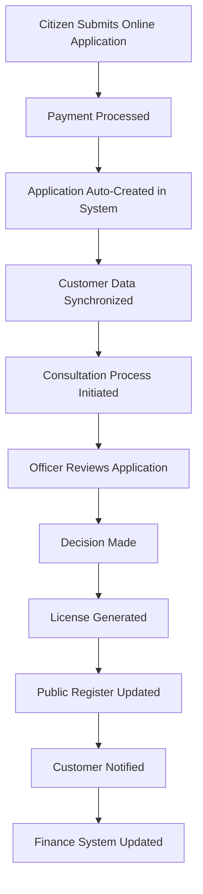
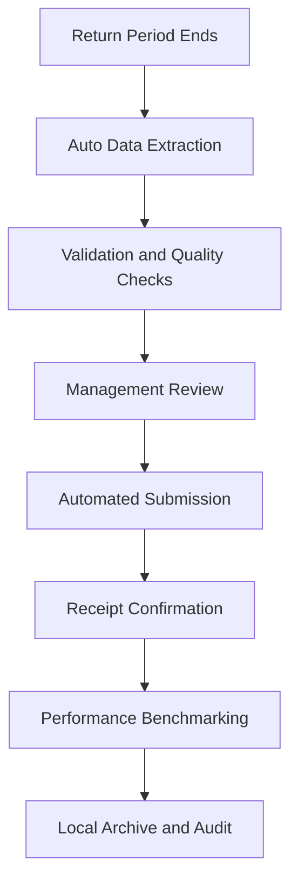
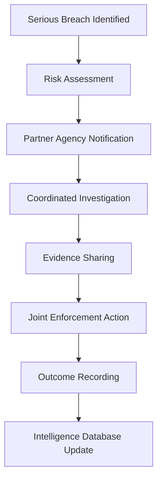

# System Integrations 

## What This Module Does for You

**Your system connections:** System Integrations in the Idox Public Protection System manages connections with external systems and data sources. This includes integrations with government databases, council systems, and external agencies that support regulatory work.

**Why it matters to your daily efficiency:** System integrations reduce duplicate data entry, enable automatic data sharing with partner agencies, and support statutory reporting requirements. They help ensure consistency of information across different systems and reduce administrative burden.

**Key benefits:**
- **Single data entry** - Enter information once, use it everywhere
- **Real-time connections** - Live data between your system and others
- **Automatic submissions** - Government returns and notifications sent automatically
- **Unified customer experience** - Citizens see consistent information across all touchpoints
- **Reduced admin burden** - Less time on data transfer, more time on regulatory work

## Quick Start Guide

### Understanding Your Connected Environment
1. **Corporate systems**: Your system connects to council CRM, finance, and document management
2. **National databases**: Direct links to FSA, HSE, DEFRA, and other government systems
3. **Public services**: Online applications and public registers fed by your data
4. **Partner agencies**: Secure sharing with police, fire authority, and health services
5. **Mobile connectivity**: Field work automatically syncs with all connected systems

### Daily Integration Benefits You'll Notice
- Licensing applications from the website appear instantly in your work queue
- Customer details auto-populate from the council's CRM system
- Inspection results automatically update public hygiene rating displays
- Enforcement actions sync with partner agencies who need to know
- Performance data feeds into corporate dashboards without manual reporting

## Common Workflows

### Workflow 1: Processing an Online License Application

#### How Online Applications Work Seamlessly:

##### Step 1: Citizen Experience
- **Public portal access**: Customer visits council website and selects license type
- **Intelligent forms**: System pre-populates known information from previous applications
- **Document upload**: Supporting documents uploaded securely to shared storage
- **Payment integration**: Secure payment processed through council's payment gateway
- **Instant acknowledgment**: Application reference provided immediately with expected timescales

##### Step 2: Your Seamless Workflow
- **Auto-creation**: Application appears in your work queue without manual intervention
- **Data completeness**: All customer data, documents, and payment details immediately available
- **Address validation**: Premises address automatically verified against council's address database
- **Automated consultations**: Relevant partner agencies automatically notified for comment
- **Corporate visibility**: Case visible in CRM system for customer service inquiries

**Key integration features you benefit from:**
- **No data re-entry**: All application details already in your system
- **Complete documentation**: Documents accessible directly from application record
- **Payment confirmation**: Real-time payment status from finance system
- **Customer history**: Previous applications and interactions automatically linked
- **Address accuracy**: Guaranteed accurate addressing from corporate gazetteer

##### Step 3: Decision and License Issuance
- **Decision recording**: Your decision automatically triggers multiple system updates
- **License generation**: Document created using corporate templates with digital signatures
- **Public register**: License details instantly appear on public website
- **Customer notification**: Automated email with license attached and next steps
- **Corporate reporting**: Statistics automatically feed into council performance dashboards

### Workflow 2: Government Return Submission (LAEMS Food Safety Return)

#### Effortless Statutory Compliance:

##### Step 1: Automatic Data Preparation
- **Scheduled extraction**: System automatically gathers required data at period end
- **Quality validation**: Built-in checks identify any data quality issues
- **Comparison analysis**: Figures compared against previous submissions for reasonableness
- **Manager notification**: Summary report sent to service manager for approval
- **No manual calculation**: All figures calculated automatically from operational data

##### Step 2: Secure Government Submission
- **Authentication**: System securely connects to FSA submission portal
- **Format compliance**: Data automatically formatted to exact government requirements
- **Digital submission**: Encrypted transmission to national database
- **Receipt capture**: Submission confirmation recorded for audit trail
- **Error handling**: Any rejection automatically routed for immediate attention

**Integration benefits that save you hours:**
- **Zero manual data entry**: All figures extracted directly from your inspection records
- **No calculation errors**: Automated totaling eliminates arithmetic mistakes
- **Deadline compliance**: Automated submission prevents missed deadlines
- **Audit readiness**: Complete submission trail maintained automatically
- **Benchmark comparison**: National comparison data received and analyzed automatically

### Workflow 3: Cross-Agency Enforcement Coordination

#### Coordinated Regulatory Response:

##### Step 1: Automatic Partner Notification (System - Immediate)
- **Risk triggers**: High-risk findings automatically trigger partner notifications
- **Secure messaging**: Encrypted notifications sent to relevant agencies
- **Information package**: Case summary and evidence automatically compiled
- **Contact coordination**: Officer contact details shared for direct collaboration
- **Urgency flagging**: Critical cases marked for immediate attention

##### Step 2: Collaborative Evidence Management (Field/Office - Duration varies)
- **Shared evidence workspace**: Secure area for multi-agency evidence sharing
- **Real-time updates**: All partners see evidence and updates immediately
- **Chain of custody**: Digital evidence handling maintains legal integrity
- **Coordinated visits**: Schedule alignment visible to all partners
- **Unified reporting**: Single incident record updated by all participating agencies

**Multi-agency coordination you get automatically:**
- **No duplicate notifications**: Partners only get relevant, timely information
- **Secure information sharing**: Legal and technical safeguards built-in
- **Coordinated decision making**: All partners have same information baseline
- **Unified intelligence**: Outcomes feed into national intelligence databases
- **Reduced bureaucracy**: Technology handles administrative coordination

## Real-World Scenarios

### Scenario 1: "The Seamless Licensing Application"

**Situation**: A new restaurant applies online for an alcohol license at 9 AM. You need to process it efficiently with consultations from police, planning, and environmental health.

**Your integrated workflow:**
1. **Instant availability**: Application appears in your queue with all details and payment confirmed
2. **Auto-consultations**: System automatically emails police, planning, and environmental health with application details
3. **Unified responses**: All consultation responses appear in your system without email management
4. **Premises verification**: Business address already verified against council's master address database
5. **Decision and publishing**: Your decision automatically updates public registers and notifies all parties

**Integration magic you don't see:**
- Customer's previous applications automatically linked from CRM system
- Premises history from planning and building control automatically available
- Payment verified in real-time from finance system
- Decision triggers automatic update to public website and national databases

### Scenario 2: "The Multi-Agency Food Poisoning Investigation"

**Situation**: Serious food poisoning outbreak requires coordination between environmental health, public health, laboratory services, and potentially police.

**Your coordinated response:**
1. **Immediate intelligence sharing**: Key case details automatically shared with public health team
2. **Laboratory integration**: Sample results automatically imported when ready
3. **Hospital notifications**: Patient data secured through health system integration
4. **Media coordination**: Communications team automatically briefed through corporate systems
5. **Resource coordination**: Management dashboard shows all agency involvement and capacity

**Behind-the-scenes coordination:**
- Patient identifiable information handled through secure health service links
- Laboratory results digitally signed and legally admissible
- Investigation timeline visible to all agencies through shared dashboard
- Evidence package automatically compiled for potential prosecution
- National notification obligations automatically fulfilled

### Scenario 3: "The Corporate Performance Review"

**Situation**: Quarterly performance review requires data about regulatory service delivery for corporate management and elected members.

**Your automated reporting:**
1. **Performance dashboard**: Real-time corporate dashboard shows your service metrics
2. **Benchmarking data**: Automatic comparison with national and regional performance
3. **Financial reconciliation**: Service income and costs automatically reconciled with finance systems
4. **Public transparency**: Required performance data automatically published to open data portal
5. **Strategic planning**: Historical trends and projections available for service planning

**Corporate integration benefits:**
- No manual data compilation for corporate reports
- Real-time visibility of service performance to senior management
- Automatic compliance with transparency requirements
- Integration with corporate risk management systems
- Service planning data available for budget and resource planning

## Integration with Other Modules

### How Integration Enhances Every Module

```mermaid
graph LR
    A[🔗 System Integrations] --> B[🏢 Enhanced Premises Data]
    A --> C[🔍 Streamlined Inspections]
    A --> D[📞 Connected Complaints]
    A --> E[📋 Automated Licensing]
    A --> F[⚖️ Coordinated Enforcement]
    A --> G[📊 Real-time Analytics]
    A --> H[📱 Synchronized Mobile]
    
    B -->|Corporate address data and CRM integration| A
    C -->|National returns and performance monitoring| A
    D -->|Multi-channel customer communications| A
    E -->|Online applications and public registers| A
    F -->|Partner agency coordination and intelligence sharing| A
    G -->|Corporate dashboards and open data| A
    H -->|Real-time sync and offline capability| A
```

#### Enhanced Data Quality and Consistency
- **Master data synchronization**: Addresses, business names, and contact details consistent across all systems
- **Real-time validation**: Data quality checks applied as information enters from any source
- **Duplicate prevention**: Automatic matching prevents duplicate records across systems
- **Historical preservation**: Complete audit trail of data changes across integrated systems

#### Streamlined User Experience
- **Single sign-on**: One login provides access to all relevant systems
- **Unified navigation**: Common user interface patterns across integrated applications
- **Context preservation**: Move between systems without losing your place in workflows
- **Personalized dashboards**: Single view of work from multiple systems

## Advanced Integration Features

### Data Quality and Validation
- **Real-time validation**: Address verification, business registration checks, payment validation
- **Cross-system consistency**: Data quality rules applied regardless of data entry point
- **Duplicate detection**: Advanced matching prevents duplicate records across systems
- **Data enrichment**: Information automatically enhanced from authoritative sources

### Security and Compliance
- **Audit logging**: Complete trail of all data exchanges and system access
- **Role-based access**: Fine-grained control over what data flows where
- **Data classification**: Sensitive data handling according to classification levels
- **Compliance monitoring**: Automatic verification of legal and policy compliance

### Performance Optimization
- **Intelligent caching**: Frequently used data cached for faster access
- **Load balancing**: Integration traffic managed to prevent system overload
- **Retry logic**: Automatic recovery from temporary connection issues
- **Priority handling**: Critical transactions processed first during high load

## Troubleshooting

### Common Issue 1: "Data not syncing between systems"

**Problem**: Changes made in one system not appearing in connected systems
**Diagnosis steps**:
- Check integration dashboard for error indicators
- Verify data meets validation rules in target system
- Review timing - some syncs are scheduled rather than real-time
- Check if affected systems are experiencing technical issues

**Solutions**:
1. **Manual sync trigger**: Force synchronization from integration management screen
2. **Data validation**: Correct any data quality issues preventing sync
3. **Escalation**: Report persistent sync issues to IT support
4. **Workaround**: Use alternative data entry point if urgent
5. **Monitoring**: Set up alerts for critical data sync failures

### Common Issue 2: "Online applications not appearing in work queue"

**Problem**: Applications submitted through public portal not creating cases
**Prevention strategies**:
- Regular testing of online application process
- Monitoring of integration dashboard for portal connections
- Verification of payment gateway integration status
- Check application validation rules aren't too restrictive

**Resolution steps**:
1. **Payment verification**: Check if payment processing completed successfully
2. **Data validation**: Ensure application meets all system requirements
3. **Manual creation**: Create case manually from application data if urgent
4. **Technical investigation**: Escalate to IT for integration diagnosis
5. **Process improvement**: Review application validation rules if recurring issue

### Common Issue 3: "Government submissions failing"

**Problem**: Statutory returns or notifications not reaching national systems
**Immediate actions**:
- Check submission status on integration dashboard
- Verify authentication credentials for national systems
- Review error messages for specific failure reasons
- Confirm submission format meets current requirements

**Recovery procedures**:
1. **Retry submission**: Use manual retry option if available
2. **Format validation**: Check data format against latest requirements
3. **Alternative methods**: Use manual upload to government portal if critical
4. **Technical support**: Engage with both local IT and national system support
5. **Deadline management**: Monitor statutory deadlines and escalate if at risk

## Tips and Best Practices

### Maximizing Integration Benefits
- **Trust the automation**: Let integrated processes work rather than duplicating manually
- **Monitor dashboards**: Regular review of integration status prevents issues
- **Data quality discipline**: Good data entry benefits all connected systems
- **User feedback**: Report integration issues quickly to maintain service quality
- **Training awareness**: Understand which actions trigger cross-system updates

### Effective Data Management
- **Single source of truth**: Use the most authoritative system for each data type
- **Consistent formatting**: Follow data standards to ensure successful integration
- **Regular verification**: Periodically check data consistency across systems
- **Change management**: Understand how system changes affect integrations
- **Documentation**: Keep local process notes aligned with integration capabilities

### Professional Service Delivery
- **Customer communication**: Explain how integrated systems provide better service
- **Expectation management**: Set realistic timescales considering integration processing
- **Issue transparency**: Communicate clearly when integration issues affect service
- **Continuous improvement**: Suggest integration enhancements based on operational experience
- **Performance awareness**: Understand how integrations support service targets

## FAQ

### Q: What happens if one of the connected systems goes down?
**A**: The system includes fallback procedures and offline capability. Critical functions continue working, and data syncs automatically when connections restore.

### Q: Can I see what data is being shared with other systems?
**A**: Yes, the integration dashboard shows all data exchanges, and audit logs track what information is shared with which systems when.

### Q: How do I know if an integration is working properly?
**A**: The integration dashboard provides real-time status of all connections, with clear indicators for successful operations and any issues requiring attention.

### Q: What if I need data from a system that's not currently integrated?
**A**: Contact IT support to discuss integration options. Many systems can be connected using standard interfaces, and some data may be available through alternative methods.

### Q: How secure is the data sharing between systems?
**A**: All integrations use encrypted connections, role-based access controls, and comprehensive audit logging. Data sharing follows strict information governance policies.

### Q: Can integrations be customized for our specific requirements?
**A**: Yes, integration rules, data mappings, and workflow triggers can often be configured to match local business processes and requirements.

### Q: What training is available for understanding the integrated environment?
**A**: Integration awareness is included in standard user training, with additional technical training available for super users and system administrators.

### Q: How do I report a problem with an integration?
**A**: Use the standard IT support process, providing specific details about the integration point and nature of the issue. The integration dashboard can provide diagnostic information.

---
