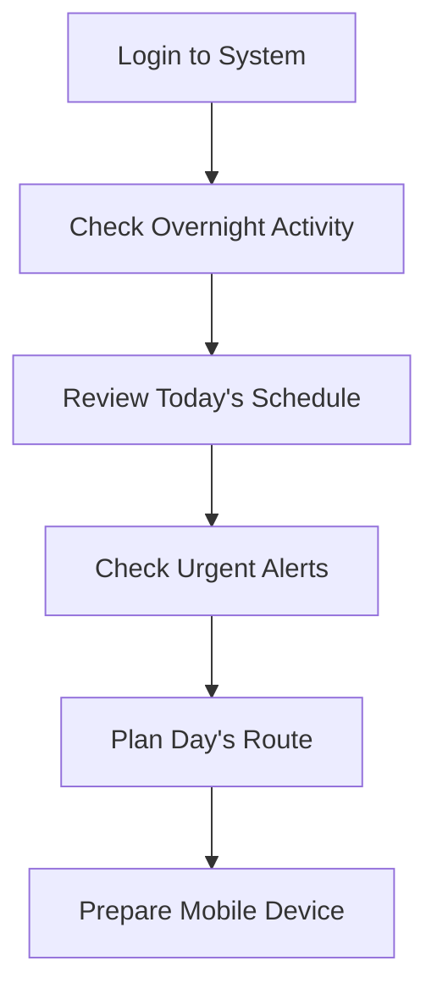
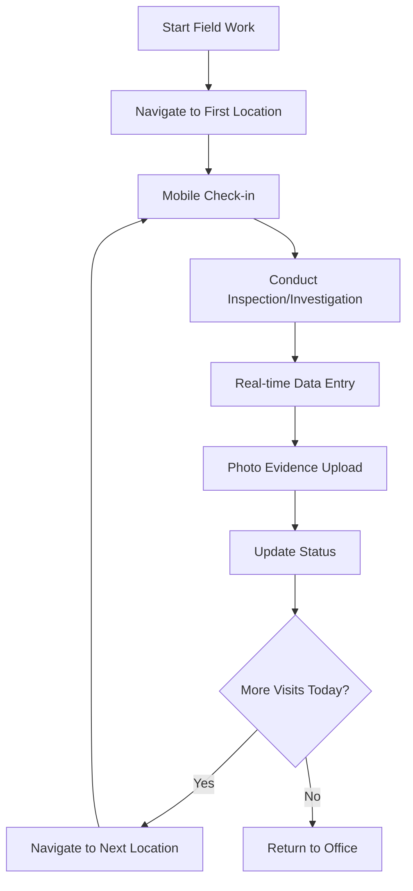
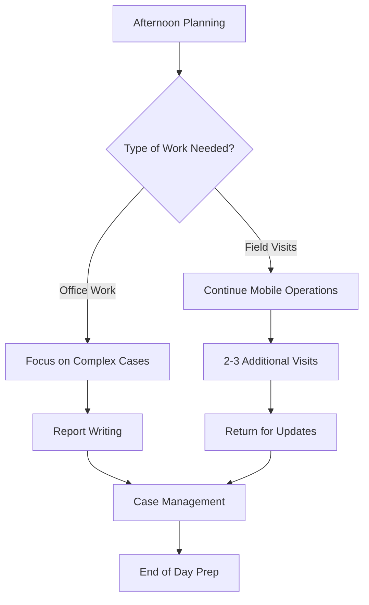
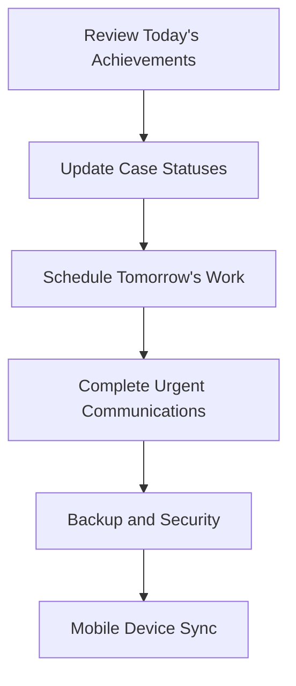

# Daily Operations Guide - Your Practical Workday Navigator

## What This Guide Does for You

**Your daily workflow companion:** This guide shows you how to use the Idox Public Protection System efficiently throughout your typical working day. It demonstrates practical approaches to managing your workload, prioritizing tasks, and using system features effectively.

**Real-world time management:** Learn practical approaches to organizing your daily work, managing multiple cases, and using the system to support efficient service delivery.

## Morning Startup Routine (8:30-9:00 AM)

### Your 15-Minute System Check

#### Step 1: Dashboard Overview
- **Navigate to**: Homepage (automatically displays on login, or click "Home" icon anytime)
- **Module sections**: Each module displays as separate section showing record count (maximum 100 records per area per user)
- **Expand sections**: Click '+' symbol next to each module heading to see detailed list of outstanding work items
- **Check highlights** by scanning each module section:
  - **Complaints**: New high-priority complaints (flagged with priority indicators)
  - **Inspections**: Inspections due today or overdue (sorted by due date)
  - **Actions**: Overdue actions requiring attention (shows days overdue)
  - **Licensing**: Committee deadlines approaching (shows days until deadline)
  - **Enforcement**: Notice compliance deadlines
- **Days to View**: Items displayed based on "Days to View" setting configured in User Details (click username top-right → "Days to View")
- **Mental priority setting**: Review all expanded lists to identify what must be done today vs what can wait

#### Step 2: Complaints Queue Review
- **Navigate to**: Click "Complaints" icon → Left-hand menu "Search Complaints" → Or use saved search "My Open Complaints"
- **Filter criteria**: Set search filters:
  - **Status** = "Open" 
  - **Priority** = "High" and "Medium" (use multi-select)
  - **Assigned Officer** = Your name
  - **Date Range** = Due this week
- **Review results**: Scan the complaint list for:
  - Food poisoning allegations (immediate site visits required, link to Food Poisoning module)
  - Noise complaints during business hours (phone calls needed)
  - Complaints approaching response deadline (check "Target Date" column)
  - Accidents or injuries (link to Accidents module for RIDDOR assessment)
- **Today's actions**: Right-click on 2-3 priority complaints → "Open in New Tab" for detailed review

#### Step 3: Inspection Schedule Check
- **Navigate to**: Click "Inspections" icon → Left-hand menu "Search Inspections" → Use saved search "My Due Inspections" or set filters:
  - **Assigned Officer** = Your name
  - **Status** = "Scheduled" 
  - **Due Date** = Today through end of week
- **Review scheduled visits** by clicking on each inspection:
  - **Appointment times**: Check "Scheduled Date/Time" field
  - **Premises history**: Click "Show Premise Info" button for quick overview
  - **Contact details**: Review business phone numbers and contact preferences
  - **Special requirements**: Check "Notes" field for access issues or special instructions
  - **Sample requirements**: Check if samples needed (Samples module integration)
- **Route planning**: 
  - Use browser mapping tools with premises addresses
  - Or export inspection list to mobile device for GPS routing
  - Consider grouping visits by geographic area
  - Use GIS module for spatial planning if available

#### Step 4: Urgent Communications
- **Check system messages**: Any urgent communications from colleagues
- **Email integration**: Review any system-generated emails requiring response
- **Calendar sync**: Ensure mobile calendar reflects today's planned visits

## Mid-Morning Field Work (9:00 AM - 12:00 PM)

### Efficient Field Operations

#### Typical Morning Schedule: 3 Premises Visits

##### Visit 1: Routine Food Hygiene Inspection (9:30-10:15 AM)
**Premises**: "Corner Café" - routine annual inspection

**Mobile workflow**:
1. **Pre-visit check**: Inspections → Select Inspection → Review Previous Reports
2. **Arrival documentation**: Use GPS check-in to confirm location
3. **Inspection conduct**: Use mobile inspection checklist
4. **Real-time scoring**: Enter scores as you inspect each area
5. **Photo evidence**: Take photos of any issues found
6. **Sample collection**: If required, create sample record via Samples left-hand menu
7. **Immediate upload**: Upload photos and notes while on-site
8. **Exit procedures**: Provide verbal feedback to manager

**System updates completed on-site**:
- Inspection score: 4 (Generally Satisfactory)
- Action plan: 3 minor improvements required
- Follow-up: Revisit in 6 months
- Premises risk: Remains at current level
- Sample records: Created if food samples taken

##### Visit 2: Complaint Investigation (10:30-11:15 AM)
**Issue**: Food hygiene complaint about "Spice Garden Restaurant"

**Mobile workflow**:
1. **Complaint review**: Complaints → Select Case → Review Details
2. **Premises history**: Check recent inspections and compliance
3. **Unannounced visit**: No prior appointment due to complaint nature
4. **Evidence gathering**: Photos of alleged issues
5. **Sample collection**: If food poisoning alleged, create Food Poisoning case
6. **Interview process**: Speak with manager about complaint allegations
7. **Immediate assessment**: Determine if immediate action needed
8. **Status update**: Update complaint status to "Investigation in Progress"

**Key mobile features used**:
- Camera integration for evidence photos
- Voice notes for interview recordings
- Complaint checklist for systematic investigation
- Real-time communication with complainant via secure messaging

##### Visit 3: License Premises Assessment (11:30 AM-12:00 PM)
**Purpose**: Site visit for new alcohol license application

**Mobile workflow**:
1. **Application review**: Licensing → Select Application → Review Submitted Plans
2. **Site verification**: Confirm layout matches submitted plans
3. **Condition assessment**: Evaluate need for specific license conditions
4. **Neighbor consultation**: Note any concerns from immediate neighbors
5. **Booking check**: Review Bookings module for any existing reservations
6. **Recommendation draft**: Initial thoughts on application
7. **Documentation**: Photos of premises layout and key areas

**Cross-module integration**:
- Link to premises record for historical context
- Check for any recent complaints about the location
- Review any previous licenses for this premises
- Check Planning module for any development applications
- Review Grants module if business received any grants
- Note findings for licensing determination process

## Lunchtime Office Work (12:00-1:00 PM)

### Administrative Tasks and System Updates

#### Quick Lunch Hour Productivity

**Priority tasks for office time**:

##### 1. Update This Morning's Work
- **Inspection reports**: Complete any missing details from mobile entries
- **Complaint updates**: Send updates to complainants about progress
- **License assessment**: Complete site visit report for application
- **Follow-up scheduling**: Book any required revisits

##### 2. Urgent Communications
- **Return phone calls**: Any urgent messages from morning visits
- **Email responses**: Reply to internal queries and requests
- **System messages**: Respond to colleague requests for information
- **Stakeholder updates**: Update other agencies if joint working involved

##### 3. Afternoon Planning
- **Route optimization**: Plan afternoon visits efficiently
- **Document preparation**: Print any forms needed for afternoon visits
- **Equipment check**: Ensure mobile device charged, camera working
- **Weather contingency**: Adjust plans if weather affects outdoor visits

## Afternoon Field and Office Mix (1:00-4:30 PM)

### Balanced Field and Desk Work

#### Afternoon Field Work Example

##### Visit 4: Follow-up Enforcement Visit (1:30-2:15 PM)
**Purpose**: Check compliance with improvement notice served last month

**Workflow**:
1. **Case review**: Enforcement → Select Case → Review Notice Requirements
2. **Notice review**: Check Notices module for served notice details
3. **Compliance check**: Systematic check against each notice requirement
4. **Evidence documentation**: Photos showing improvements made
5. **Outstanding issues**: Note any requirements still not met
6. **Next steps decision**: Determine if further action needed
7. **Business communication**: Provide clear feedback on compliance status

##### Visit 5: License Premises Monitoring (2:30-3:00 PM)
**Purpose**: Check compliance with recently varied license conditions

**Workflow**:
1. **License review**: Licensing → View License → Check Current Conditions
2. **Condition monitoring**: Verify each condition being met
3. **Operating assessment**: Observe current operation during business hours
4. **Issue identification**: Note any potential condition breaches
5. **Documentation**: Record findings for license compliance file

#### Afternoon Office Work (3:15-4:30 PM)

##### Complex Case Management

**Major tasks requiring desk time**:

1. **Committee Report Writing**
   - **Case**: License review for "The Crown Inn"
   - **Process**: Licensing → Committee → Generate Report
   - **Content**: Compile evidence from inspections, complaints, enforcement
   - **Recommendations**: Draft officer recommendations with justification
   - **Supporting docs**: Attach all relevant evidence and correspondence

2. **Prosecution Case Preparation**
   - **Case**: Food safety prosecution for "Quick Bites Takeaway"
   - **Process**: Prosecutions module → Create new prosecution case
   - **Documentation**: Organize inspection reports, photos, correspondence
   - **Legal review**: Prepare case summary for legal team
   - **Timeline**: Ensure all evidence properly dated and witnessed

3. **Statistical Returns**
   - **Monthly reporting**: Complete required performance statistics
   - **Process**: Reports → Performance → Monthly Returns
   - **Data verification**: Check figures against individual case records
   - **Trend analysis**: Note any patterns or concerns for management

## End of Day Wrap-up (4:30-5:00 PM)

### Efficient Day Closure

#### Final 30 Minutes Checklist

##### 1. Status Updates and Communications
- **Complaint updates**: Send end-of-day updates to complainants where promised
- **Business communications**: Send any follow-up letters or emails from today's visits
- **Internal updates**: Update colleagues on joint working or handovers
- **Urgent actions**: Flag anything requiring immediate attention tomorrow

##### 2. System Housekeeping
- **Case status updates**: Ensure all today's work properly recorded
- **Photo uploads**: Verify all evidence photos uploaded and linked correctly
- **Document completion**: Complete any outstanding inspection reports or notes
- **Calendar updates**: Book any appointments made during today's visits

##### 3. Tomorrow's Preparation
- **Priority review**: Check tomorrow's priority tasks and appointments
- **Equipment prep**: Ensure mobile device charged and ready
- **Route planning**: Quick review of tomorrow's travel requirements
- **Outstanding actions**: Note any urgent items for first thing tomorrow

## Weekly Workflow Patterns

### Monday: Planning and High-Priority Response
- **Morning**: Clear weekend complaints backlog, plan week's inspections
- **Focus**: High-priority complaints and urgent enforcement matters
- **Admin**: Update weekend work, respond to urgent communications

### Tuesday-Thursday: Maximum Field Time
- **Morning**: Early starts for maximum site visit time
- **Focus**: Routine inspections, complaint investigations, monitoring visits
- **Admin**: Minimal - focus on field work and real-time updates

### Friday: Admin and Case Development
- **Morning**: Complete week's outstanding reports and communications
- **Focus**: Complex case work, committee preparations, prosecution files
- **Admin**: Week's statistics, next week's planning, team meetings

## Time Management Tips

### Efficient Task Batching
- **Geographic batching**: Group visits by area to minimize travel
- **Task type batching**: Do similar tasks together (all inspections, then all complaint investigations)
- **Communication batching**: Set specific times for phone calls and emails
- **Admin batching**: Block time for report writing and case updates

### Mobile vs Desktop Work
**Best done on mobile**:
- Site visits and inspections
- Real-time evidence gathering
- GPS check-ins and route following
- Quick status updates
- Photo uploading

**Best done on desktop**:
- Complex report writing
- Multi-case analysis
- Detailed research and review
- Committee papers and legal documents
- Statistical analysis and reporting

### Interruption Management
- **Urgent vs important**: Use system priority flags to distinguish
- **Delegation opportunities**: What can be handled by colleagues
- **Scheduling interruptions**: Set specific times for non-urgent calls
- **Documentation discipline**: Record all interactions for continuity

## Advanced Workflow Features

### Action Schedule Templates
Action Schedule templates create automated sequences of actions with defined timing:
- **Template selection**: Choose appropriate schedule code for the type of work
- **Officer assignment**: Assign schedule to specific officer (can reassign individual actions later)
- **Bulk creation**: 'Add Action(s)' button creates entire sequence of planned actions
- **Automatic timing**: System applies predefined time intervals between actions
- **Admin configuration**: Schedule templates configured in admin section with sequences and timings
- **Practical use**: Ideal for complex processes like license applications, enforcement cases, or investigation protocols

### Using Action Schedules Effectively
- **Standard processes**: Use for any multi-step process that follows consistent timing
- **Team coordination**: Actions can be distributed across team members as needed
- **Progress tracking**: Each action tracked individually with planned and completed dates
- **Flexibility**: Individual actions can be modified after schedule creation
- **Consistency**: Ensures standard processes follow same steps and timings

## Common Daily Challenges and Solutions

### Challenge 1: "Too many urgent complaints"
**Solution**: 
- Use risk assessment to truly prioritize
- Batch similar complaints for efficient investigation
- Use mobile updates to keep complainants informed
- Delegate lower-risk cases where possible

### Challenge 2: "Constant interruptions disrupting planned work"
**Solution**:
- Block specific times for focused work
- Use system messaging instead of phone calls where possible
- Set expectations about response times
- Plan buffer time for unexpected urgent issues

### Challenge 3: "Paperwork taking over field time"
**Solution**:
- Use mobile data entry to minimize office admin
- Batch paperwork into dedicated time blocks
- Use templates and standard phrases for efficiency
- Complete simple tasks immediately rather than deferring

### Challenge 4: "Struggling to keep up with deadlines"
**Solution**:
- Use system alerts and reminders proactively
- Plan backward from deadlines to identify critical path
- Build buffer time into complex cases
- Communicate early if deadline pressure developing

---

*This guide reflects the real-world experience of regulatory officers using the Idox Public Protection System efficiently and effectively throughout their working day.*