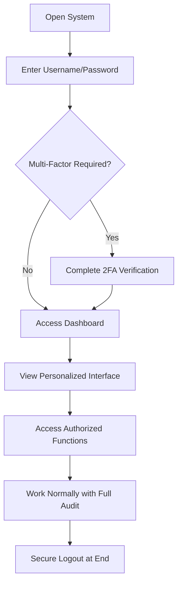
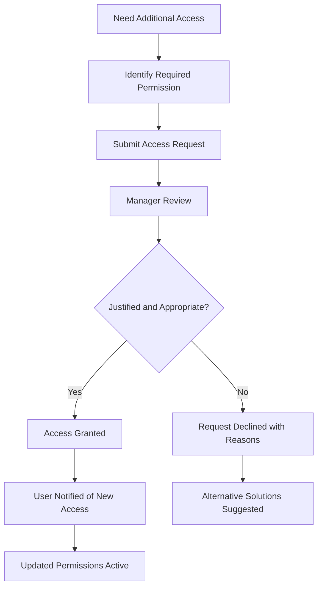
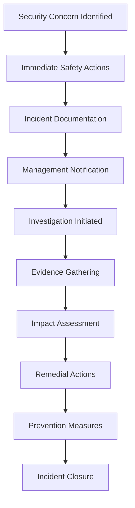

# User Management and Security 

## What This Module Does for You

**Your system access and security:** User Management and Security in the Idox Public Protection System controls user access, manages permissions, and maintains system security. It ensures users have appropriate access to system functions based on their roles and responsibilities.

**Why it matters to your professional work:** Proper user management ensures that sensitive regulatory information is protected, users can only access functions appropriate to their role, and all system activities are properly logged for audit purposes. This protects both the organization and the individuals using the system.

**Key benefits:**
- **Legal authority protection** - Only authorized officers can perform specific regulatory functions
- **Data security assurance** - Sensitive information protected from unauthorized access
- **Audit trail creation** - Complete record of all actions for legal accountability
- **Simplified access** - Single login provides access to everything you're authorized to use
- **Mobile security** - Safe access to sensitive data even when working in the field

## Quick Start Guide

### Understanding Your User Profile
1. **Your permissions**: Based on your role, qualifications, and legal authorizations
2. **Your access areas**: Geographic boundaries and service areas you can work in
3. **Your authority levels**: What decisions you can make independently vs. need approval for
4. **Your credentials**: Professional qualifications and statutory authorizations tracked
5. **Your audit trail**: Every action you take is recorded for legal protection

### Managing Your User Details
Access by clicking your username (top right, beside "logged in as"):
- **Personal Information**: First Name, Surname, Email (keep current for password recovery)
- **Contact Details**: Phone Number, Department (selected from dropdown)
- **System Preferences**: Support Button Location, Homepage setting
- **Display Options**: Ward and Parish Codes enabled, Days to View (global setting)
- **Work Preferences**: Auto Assign Inspections settings, Default Licence Search Page
- **Password Management**: Change password (delete both password fields completely, enter new password, confirm by re-entering, save)
  - **Critical**: Password fields show masked characters - always completely clear both fields before entering new password
  - **Security**: Never assume fields are empty - the mask obscures both characters and length
  - **Browser warning**: Disable 'Remember Passwords' functionality for security and practical reasons

### Daily Security Practices
- Log in using your secure credentials (username/password + 2FA if required)
- Never share your login details with colleagues
- Lock your screen when leaving your desk
- Log out properly at end of day
- Report any suspicious activity or security concerns immediately

### Password Recovery and Account Management

#### Automatic Password Recovery Process
If you enter an invalid username/password combination, you'll be presented with the password recovery screen:

- **Account lockout protection**: 3 incorrect login attempts locks your individual account permanently
- **Self-service recovery**: Enter your valid username on the recovery screen
- **Automatic generation**: System generates new password and sends to your registered email address
- **Username validation**: System informs you if username is invalid during recovery
- **Email confirmation**: System prompts you to check your email after valid username entry
- **Email dependency**: Valid email address MUST be configured in your user profile for recovery to work
- **Administrative support**: Contact local System Administrator if account locked or email recovery fails
- **Support limitations**: Idox cannot assist with forgotten passwords or locked accounts once system is live

#### Secure Password Management
- **Change default passwords**: All users must change initial default passwords issued for first login
- **Follow ICT policy**: Change passwords according to your organization's ICT security protocol requirements
- **Unique credentials**: Never share accounts between users - each person must have individual login
- **Credential security**: Keep login details safe and follow Council's ICT Security policy
- **Browser security**: If password entered incorrectly, forgotten password screen displays - press 'Home' to return to login

## Common Workflows

### Workflow 1: Secure Login and Daily Access

#### Your Secure Access Process:

##### Step 1: Authentication
- **Primary login**: Enter your unique username and password
- **Multi-factor authentication**: Complete additional verification if required (SMS code, app notification)
- **Device recognition**: System recognizes trusted devices for streamlined access
- **Access validation**: System confirms your account is active and authorized
- **Session establishment**: Secure session created with your specific permissions

##### Step 2: Personalized System Access (Immediate)
- **Role-based interface**: System shows only functions you're authorized to use
- **Geographic filtering**: Only premises/areas within your jurisdiction visible
- **Permission-based menus**: Navigation adapted to your authority levels
- **Credential verification**: System checks your current professional qualifications
- **Work queue loading**: Your assigned tasks and cases displayed

**What you see is customized to your role:**
- **Officer level**: Basic inspection, complaint, and licensing functions
- **Senior officer**: Additional enforcement and decision-making capabilities
- **Manager level**: Team oversight, reporting, and approval functions
- **Specialist roles**: Specific technical functions (sampling, prosecution, etc.)
- **Administrative**: User management and system configuration options

##### Step 3: Secure Working Session
- **Activity monitoring**: All your actions automatically logged for audit
- **Permission checking**: System prevents unauthorized actions before you attempt them
- **Session management**: Automatic timeout if idle to protect data
- **Data protection**: Sensitive information appropriately masked or restricted
- **Mobile synchronization**: Same security controls apply on mobile devices

### Workflow 2: Requesting Additional Access or Permissions

#### Access Request Process:

##### Step 1: Identifying Access Needs
- **Functional requirement**: Determine exactly what access you need and why
- **Role justification**: Confirm the access is appropriate for your role
- **Business case**: Understand how additional access supports service delivery
- **Duration**: Determine if access is permanent or temporary
- **Risk assessment**: Consider any additional risks the access might create

##### Step 2: Formal Request Submission
- **Request form**: Complete access request through system or manager
- **Justification documentation**: Provide clear business case for access
- **Impact assessment**: Explain how lack of access affects your work
- **Training confirmation**: Confirm you have appropriate training for new functions
- **Manager endorsement**: Obtain line manager support for request

##### Step 3: Approval Process
- **Management review**: Request assessed by appropriate manager
- **Policy compliance**: Check against information governance policies
- **Risk evaluation**: Security and operational risks considered
- **Training needs**: Additional training requirements identified
- **Decision recording**: Approval or refusal documented with reasons

##### Step 4: Access Implementation (Same day once approved)
- **Permission update**: System permissions modified by administrator
- **User notification**: You're informed when new access is active
- **Training delivery**: Any required training arranged
- **Review scheduling**: Regular review of ongoing access need scheduled
- **Audit recording**: All changes fully documented in audit trail

### Workflow 3: Incident Reporting and Security Concerns

#### Security Incident Response:

##### Step 1: Immediate Response (Immediate)
- **Assess situation**: Determine severity and immediate risks
- **Protect evidence**: Don't alter anything that might be relevant
- **Secure systems**: Change passwords if compromise suspected
- **Document details**: Note exactly what happened and when
- **Notify management**: Alert your supervisor immediately

##### Step 2: Formal Incident Reporting
- **Incident form**: Complete security incident report with full details
- **Timeline documentation**: Record exact sequence of events
- **Impact assessment**: Describe what data or systems might be affected
- **Evidence preservation**: Gather and protect relevant evidence
- **Witness information**: Identify anyone else who observed the incident

**Common security incidents to report:**
- **Suspected unauthorized access**: Someone using system inappropriately
- **Data breach concerns**: Potential exposure of sensitive information
- **Physical security**: Lost devices, unauthorized access to offices
- **Social engineering**: Suspicious contact requesting information
- **System anomalies**: Unusual system behavior or error messages

##### Step 3: Investigation and Resolution
- **Professional investigation**: IT security team conducts technical investigation
- **Evidence analysis**: Digital forensics if required
- **Impact assessment**: Determine actual damage or exposure
- **Stakeholder notification**: Inform affected parties as appropriate
- **Remedial actions**: Implement security improvements and controls

## Real-World Scenarios

### Scenario 1: "The Forgotten Password Monday Morning"

**Situation**: You arrive Monday morning and can't remember your password after a week's holiday.

**Your secure recovery process:**
1. **Self-service reset**: Use password reset link if available and your details are current
2. **IT helpdesk contact**: Call IT support with identification for manual reset
3. **Manager verification**: Your manager may need to confirm your identity
4. **Temporary access**: Receive temporary credentials for immediate work needs
5. **Secure password setup**: Create new strong password following policy guidelines

**Security protections during recovery:**
- **Identity verification**: Multiple checks confirm you are who you claim to be
- **Temporary restrictions**: Limited access until full verification complete
- **Manager notification**: Your supervisor informed of password reset for security
- **Audit logging**: Complete record of password reset process maintained
- **Security questions**: Additional verification if available

### Scenario 2: "The Suspicious Email with Urgent Request"

**Situation**: You receive an email appearing to be from senior management requesting immediate access to sensitive case files for an "urgent investigation."

**Your security awareness response:**
1. **Verification first**: Contact the supposed sender directly via known contact details
2. **Question urgency**: Genuine urgent requests usually come through official channels
3. **Protect information**: Don't provide access credentials or sensitive data via email
4. **Report suspicious contact**: Alert IT security team about potential phishing
5. **Follow procedures**: Use established processes for sharing sensitive information

**Key security indicators:**
- **Unusual requests**: Requests outside normal procedures should be questioned
- **Email authenticity**: Check sender details carefully for spoofing
- **Urgency pressure**: Social engineering often uses artificial time pressure
- **Information requests**: Requests for passwords or access should never be honored
- **Official channels**: Legitimate requests come through proper management channels

### Scenario 3: "The Mobile Device Security Concern"

**Situation**: Your work mobile device is stolen from your car containing sensitive case information and photos from inspections.

**Your immediate security response:**
1. **Report immediately**: Contact IT helpdesk and your manager immediately
2. **Remote wipe activation**: IT team remotely clears device of all data
3. **Account security**: All account passwords changed as precaution
4. **Impact assessment**: Review what sensitive data was potentially exposed
5. **Incident documentation**: Complete formal security incident report

**Built-in mobile security protections:**
- **Device encryption**: All data encrypted and unreadable without authentication
- **Remote wipe capability**: Complete device clearing possible remotely
- **Automatic logout**: Device locks automatically when not in use
- **Secure containers**: Work data separated from personal information
- **Access monitoring**: Unauthorized access attempts logged and tracked

## Integration with Other Modules

### How Security Protects Every Aspect of Your Work

```mermaid
graph LR
    A[🔐 User Security] --> B[🏢 Premises Access Control]
    A --> C[🔍 Inspection Authorization]
    A --> D[📞 Complaint Data Protection]
    A --> E[📋 Licensing Decision Authority]
    A --> F[⚖️ Enforcement Power Controls]
    A --> G[📊 Sensitive Report Access]
    A --> H[📱 Mobile Security]
    
    B -->|Geographic and role-based access| A
    C -->|Qualification and authority verification| A
    D -->|Confidential information protection| A
    E -->|Financial and decision authority limits| A
    F -->|Legal power delegation tracking| A
    G -->|Data sensitivity and anonymization| A
    H -->|Secure field access and evidence protection| A
```

#### Role-Based Access Examples
- **Junior Officers**: Basic inspection and complaint functions within assigned areas
- **Senior Officers**: Additional enforcement powers and cross-boundary access
- **Team Leaders**: Staff oversight, case assignment, and quality assurance functions
- **Specialists**: Technical functions like sampling, prosecution preparation, or appeals
- **Managers**: Approval authorities, strategic reporting, and resource management

#### Geographic Access Controls
- **Ward boundaries**: Access limited to officer's assigned geographic areas
- **Service areas**: Different permissions for different types of regulatory work
- **Cross-boundary**: Special permissions for cases crossing normal boundaries
- **Regional access**: Senior officers may have wider geographic access
- **Temporary assignments**: Access adjusted for temporary postings or project work

## Advanced Security Features

### Audit Trail and Accountability
- **Complete activity logging**: Every action recorded with user, time, and context
- **Data change tracking**: Before and after values for all significant changes
- **Legal evidence quality**: Audit records suitable for court proceedings
- **Tamper protection**: Audit logs protected from unauthorized modification
- **Long-term retention**: Audit data retained for legal and compliance requirements

### Data Protection and Privacy
- **Data classification**: Automatic identification and protection of sensitive data
- **Access need verification**: Regular reviews ensure access remains appropriate
- **Data minimization**: Only necessary data visible based on role and case involvement
- **Consent tracking**: Management of data subject consents where required
- **Right to be forgotten**: Controlled data deletion when legally required

### Mobile and Remote Security
- **Secure authentication**: Same security standards for mobile and remote access
- **Device management**: Corporate control over devices accessing sensitive data
- **VPN protection**: Secure network connections for remote working
- **Offline security**: Data protection even when working without connectivity
- **Location awareness**: Security controls adjusted based on access location

## Troubleshooting

### Common Issue 1: "I can't see a case/premises I need to work on"

**Problem**: Case or premises exists but not visible in your system view
**Possible causes**:
- Geographic restrictions limiting your access to the area
- Case sensitivity requiring higher access levels
- Team assignment restrictions
- Data sharing limitations from external sources

**Solutions**:
1. **Check location**: Verify the premises is within your assigned area
2. **Request access**: Ask manager for temporary or permanent access if justified
3. **Team consultation**: Speak to colleague who can access the record
4. **Case transfer**: Request case transfer to your team if appropriate
5. **Escalation**: Raise with management if access is preventing service delivery

### Common Issue 2: "System says I don't have permission for this action"

**Problem**: Attempting an action but system prevents it due to permissions
**Diagnosis steps**:
- Check if action requires higher authority level
- Verify if professional qualification required
- Consider if financial authority limit exceeded
- Review if geographic restrictions apply

**Solutions**:
1. **Training verification**: Confirm you have required qualifications recorded
2. **Authority request**: Seek delegation of higher authority if appropriate
3. **Manager approval**: Use approval workflow for actions above your level
4. **Specialist referral**: Pass to colleague with appropriate authority
5. **Policy clarification**: Check if policy allows the action for your role

### Common Issue 3: "My mobile device won't sync securely"

**Problem**: Mobile device not connecting securely to system
**Technical checks**:
- Network connectivity and signal strength
- VPN connection status if required
- App version and updates
- Device certificate validity

**Solutions**:
1. **Network troubleshooting**: Check WiFi/cellular connectivity
2. **App restart**: Close and restart the mobile application
3. **VPN reconnection**: Disconnect and reconnect VPN if used
4. **Certificate renewal**: Contact IT for certificate refresh
5. **Device re-enrollment**: Re-register device with corporate mobile management

## Tips and Best Practices

### Strong Security Habits
- **Unique passwords**: Use strong, unique passwords for work accounts
- **Regular updates**: Keep mobile apps and devices updated
- **Clean desk policy**: Don't leave sensitive documents visible
- **Secure communications**: Use official channels for sensitive discussions
- **Incident reporting**: Report security concerns promptly, however minor

### Effective Access Management
- **Request only what you need**: Don't request unnecessary access permissions
- **Regular reviews**: Participate constructively in access reviews
- **Training compliance**: Complete security training promptly
- **Policy awareness**: Stay current with information governance policies
- **Professional responsibility**: Use access appropriately and responsibly

### Mobile Security Excellence
- **Device lock**: Always lock mobile devices when not in use
- **App discipline**: Only install approved applications
- **WiFi caution**: Be careful with public WiFi for sensitive work
- **Physical security**: Protect devices from theft and unauthorized access
- **Data hygiene**: Regularly clear unnecessary files and data

## FAQ

### Q: How often do I need to change my password?
**A**: Follow your organization's password policy. Use strong, unique passwords and never reuse work passwords for personal accounts.

### Q: What should I do if I think someone else knows my password?
**A**: Change your password immediately and report the potential compromise to IT security. The system can also be checked for unusual activity on your account.

### Q: Can I work from home on sensitive cases?
**A**: Remote working is usually possible with appropriate security measures (VPN, secure devices). Check your organization's remote working policy and ensure you have required security tools.

### Q: What happens if I access something I shouldn't have?
**A**: All access is logged, so inappropriate access will be detected. If accidental, report it immediately. Deliberate misuse may result in disciplinary action.

### Q: How do I know what access permissions I have?
**A**: Your permissions are visible in your user profile, or you can request a summary from your manager or IT team. The system interface adapts to show only what you can access.

### Q: Can I delegate my access to a colleague when I'm on leave?
**A**: Some systems allow temporary delegation with appropriate approval. Check with your manager about covering arrangements for your cases during absence.

### Q: What if I need emergency access outside normal hours?
**A**: Emergency access procedures exist for genuine urgencies. Contact the out-of-hours IT support or on-call manager, but expect enhanced scrutiny and audit of emergency access.

### Q: How long are my activities kept in the audit log?
**A**: Audit logs are typically retained for several years for legal and compliance purposes. The exact retention period depends on data type and legal requirements.

---
