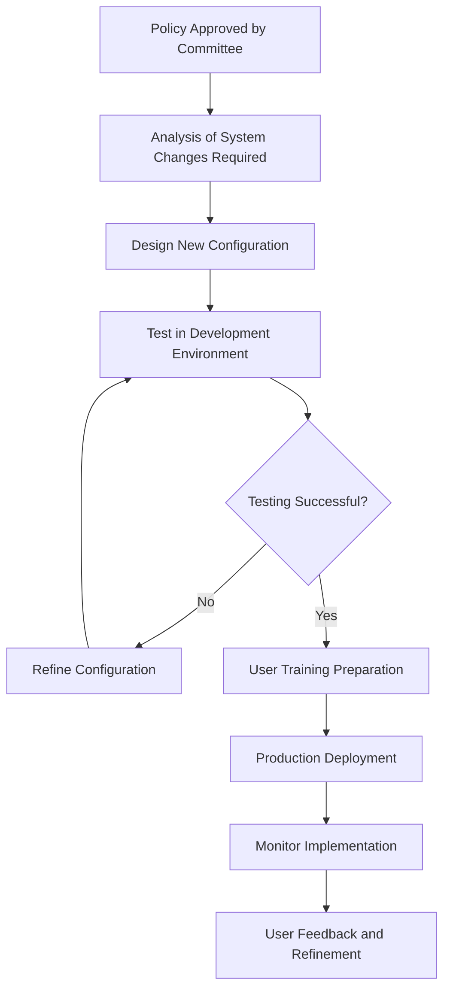
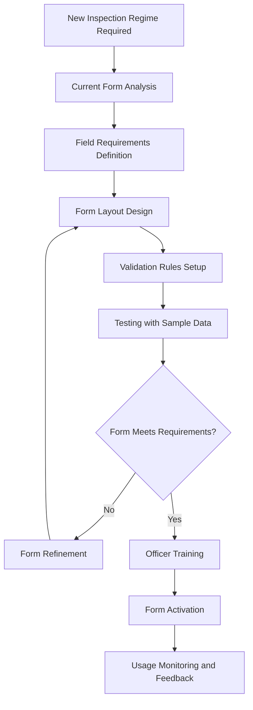
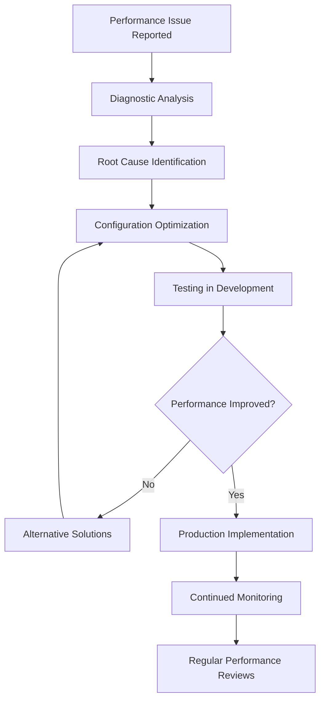

# System Configuration and Administration 

## What This Module Does for You

**Your system administration center:** System Configuration and Administration in the Idox Public Protection System manages system settings, user accounts, and administrative functions. It enables authorized users to configure system behavior, manage user access, and maintain system reference data.

**Why it matters to your service delivery:** Proper system configuration ensures that the system works according to your organization's policies and procedures. It enables you to customize the system to match local requirements while maintaining data integrity and security.

**Key benefits:**
- **Policy alignment** - System behavior matches your approved policies and procedures
- **Process optimization** - Workflows adapted to your team structure and operational priorities
- **Local terminology** - System language reflects your organization's preferred terms
- **Performance monitoring** - Dashboards tailored to your management reporting requirements
- **Adaptive capability** - Rapid response to legislative changes and process improvements

## Quick Start Guide

### Understanding Configuration Scope
1. **What you can configure**: Forms, workflows, reference data, reports, user interfaces
2. **What requires IT support**: Database structure, integrations, security settings
3. **Your configuration role**: Depends on your job function and system permissions
4. **Change management**: How configuration changes are tested and deployed
5. **Training implications**: How configuration changes affect user training needs

### Configuration Categories by Role
- **Service Managers**: Policy implementation, performance metrics, approval workflows
- **Team Leaders**: Work allocation rules, task priorities, team-specific customizations  
- **Senior Officers**: Form design, business rules, reference data management
- **System Administrators**: User permissions, integration settings, system monitoring
- **Super Users**: Advanced configurations, testing new settings, user support

## Common Workflows

### Workflow 1: Implementing New Local Policy (e.g., Enhanced Risk Assessment Approach)

#### Step-by-Step Policy Implementation:

##### Step 1: Requirements Analysis
- **Policy review**: Detailed analysis of approved policy changes
- **System mapping**: Identify which system elements need modification
- **Impact assessment**: Understand effects on forms, workflows, and reports
- **Stakeholder consultation**: Confirm interpretation with policy owners
- **Timeline planning**: Set realistic implementation schedule

##### Step 2: Configuration Design
- **Form modifications**: Adapt inspection forms to capture new risk factors
- **Workflow adjustments**: Modify process stages to reflect new approval requirements
- **Reference data updates**: Add new risk categories or scoring criteria
- **Report modifications**: Ensure performance reports reflect new approach
- **User interface changes**: Adapt dashboards and menus for new functionality

**Configuration areas typically involved:**
- **Risk scoring matrices**: New calculation rules and weighting factors
- **Inspection forms**: Additional fields for enhanced risk assessment
- **Approval workflows**: Modified approval paths for higher-risk premises
- **Report templates**: Updated management reports showing new risk metrics
- **User permissions**: Access controls for new risk assessment functions

##### Step 3: Testing and Validation
- **Test environment setup**: Configure test system with new settings
- **Scenario testing**: Work through various premises types with new risk approach
- **Workflow testing**: Verify approval paths work correctly
- **Report verification**: Confirm reports calculate and display correctly
- **User acceptance testing**: Key users validate configuration meets policy requirements

##### Step 4: Production Deployment
- **Deployment planning**: Schedule implementation during low-usage periods
- **Configuration migration**: Transfer tested settings to live system
- **Verification testing**: Confirm deployment successful and functioning correctly
- **User notification**: Inform staff of changes and new procedures
- **Support preparation**: Ensure help desk ready for user questions

#### Common Configuration Challenges and Solutions:

**Challenge: "Policy requires complex risk calculation"**
- **Solution**: Use formula builder to create custom risk scoring algorithms
- **Alternative**: Implement lookup tables with weighted scores
- **Consideration**: Test calculation with range of premises types

**Challenge: "New approval process involves multiple teams"**
- **Solution**: Configure sequential or parallel approval workflows
- **Alternative**: Use conditional routing based on risk scores or premises types
- **Consideration**: Set appropriate timeframes and escalation rules

### Workflow 2: Customizing Forms for Specialist Inspections

#### Form Customization Process:

##### Step 1: Requirements Gathering
- **Regulatory requirements**: Identify what information must be captured
- **Process mapping**: Understand how form fits into overall inspection workflow
- **Officer consultation**: Discuss practical field requirements with inspection officers
- **Legal compliance**: Ensure form meets any statutory documentation requirements
- **Mobile considerations**: Confirm form works effectively on mobile devices

##### Step 2: Form Design
- **Field selection**: Choose appropriate field types (text, dropdown, checkbox, etc.)
- **Layout organization**: Group related fields logically for efficient completion
- **Mandatory fields**: Identify fields that must be completed before submission
- **Conditional fields**: Set up fields that appear based on other responses
- **Help text addition**: Provide guidance for complex or technical fields

**Form design best practices:**
- **Logical flow**: Arrange fields in order they would naturally be completed
- **Clear labeling**: Use terminology familiar to inspection officers
- **Efficient completion**: Minimize clicks and data entry required
- **Error prevention**: Use dropdowns and validation to prevent data errors
- **Mobile optimization**: Ensure form works well on mobile devices

##### Step 3: Business Rules Configuration
- **Validation rules**: Set up checks to ensure data quality and completeness
- **Calculation fields**: Configure automatic calculations (scores, totals, percentages)
- **Conditional logic**: Set rules for when fields appear or become mandatory
- **Default values**: Set sensible defaults to speed up form completion
- **Error messages**: Create helpful error messages for validation failures

##### Step 4: Testing and Refinement
- **Functionality testing**: Verify all fields, calculations, and rules work correctly
- **Usability testing**: Check form is efficient and intuitive to complete
- **Data quality testing**: Confirm validation rules prevent common errors
- **Mobile testing**: Verify form works properly on various mobile devices
- **Performance testing**: Ensure form loads and saves quickly

### Workflow 3: System Performance Monitoring and Optimization

#### Performance Management Process:

##### Step 1: Performance Monitoring
- **Dashboard review**: Check system health indicators daily
- **User feedback**: Monitor help desk tickets for performance complaints
- **Resource utilization**: Review server performance and database metrics
- **Response times**: Check page load times and transaction completion speeds
- **Error rates**: Monitor system errors and user-reported issues

##### Step 2: Issue Diagnosis
- **Performance analysis**: Use system tools to identify bottlenecks
- **Usage pattern review**: Analyze how users interact with slow functions
- **Configuration assessment**: Review settings that might impact performance
- **Resource constraints**: Check if hardware limits are being reached
- **Integration issues**: Verify external system connections are performing well

**Common performance issues and solutions:**
- **Slow page loading**: Optimize database queries, adjust caching settings
- **Report generation delays**: Schedule large reports for off-peak hours
- **Mobile sync issues**: Adjust synchronization frequency and data volume
- **Form completion slowness**: Simplify complex forms or add progressive loading
- **Search result delays**: Optimize search indexing and filtering

##### Step 3: Optimization Implementation
- **Configuration tuning**: Adjust system settings for better performance
- **Index optimization**: Improve database indexing for common queries
- **Cache management**: Configure appropriate caching for frequently accessed data
- **Archiving setup**: Move old data to archive storage to improve performance
- **User guidance**: Provide tips for more efficient system usage

## Real-World Scenarios

### Scenario 1: "The Legislative Change Emergency"

**Situation**: New legislation requires additional data capture on all food inspections and changes risk scoring methodology.

**Your rapid response approach:**
1. **Immediate analysis**: Review legislation to identify exact system changes required
2. **Priority configuration**: Focus on essential changes first, enhancements later
3. **Parallel development**: Configure changes in test environment while planning deployment
4. **User preparation**: Begin training preparation while configuration is being tested
5. **Phased deployment**: Implement essential changes immediately, refinements later

**Configuration changes required:**
- **New form fields**: Additional inspection criteria mandated by legislation
- **Risk scoring update**: New calculation methodology for compliance ratings
- **Report modifications**: Updated statutory returns reflecting new data requirements
- **Validation rules**: Ensure new mandatory fields are completed
- **Help text updates**: Guidance on new requirements for inspection officers

### Scenario 2: "The Service Restructure Configuration"

**Situation**: Management restructure creates new teams with different geographic boundaries and specializations requiring system reconfiguration.

**Your systematic approach:**
1. **Organizational mapping**: Document new team structures and responsibilities
2. **Geographic redefinition**: Update system boundaries to match new team areas
3. **User role updates**: Modify permissions and access levels for new roles
4. **Workflow adjustments**: Update task assignment rules for new team structure
5. **Reporting realignment**: Modify management reports for new organizational structure

**System areas requiring updates:**
- **User permissions**: Access rights aligned with new roles and responsibilities
- **Geographic boundaries**: Team assignment areas updated in system
- **Workflow routing**: Task assignment rules modified for new structure
- **Reporting hierarchies**: Management reports reflect new organizational lines
- **Dashboard configurations**: Team dashboards customized for new specializations

### Scenario 3: "The Performance Improvement Initiative"

**Situation**: Service performance below target, requiring system configuration changes to support improvement plan.

**Your improvement support:**
1. **Performance analysis**: Use system data to identify specific bottlenecks
2. **Process optimization**: Streamline workflows to reduce administrative overhead
3. **Automation enhancement**: Configure additional automated processes
4. **Monitoring improvement**: Enhanced dashboards for performance tracking
5. **User efficiency**: Configuration changes to support faster task completion

**Configuration optimizations:**
- **Workflow streamlining**: Remove unnecessary approval steps for routine matters
- **Automated assignment**: Better algorithms for distributing work efficiently  
- **Enhanced monitoring**: Real-time dashboards for performance tracking
- **Process shortcuts**: Quick actions for common routine tasks
- **Mobile optimization**: Better mobile forms for field efficiency

## Integration with Other Modules

### How Configuration Controls Every Module

```mermaid
graph LR
    A[⚙️ System Configuration] --> B[🏢 Premises Classifications]
    A --> C[🔍 Inspection Forms & Workflows]
    A --> D[📞 Complaint Categories & SLAs]
    A --> E[📋 License Types & Fees]
    A --> F[⚖️ Enforcement Templates & Rules]
    A --> G[📊 Report Templates & Metrics]
    A --> H[👥 User Roles & Permissions]
    
    B -->|Reference data and validation rules| A
    C -->|Process flows and business rules| A
    D -->|Prioritization and routing rules| A
    E -->|Application forms and approval workflows| A
    F -->|Document templates and approval hierarchies| A
    G -->|Data definitions and calculation formulas| A
    H -->|Access controls and audit requirements| A
```

#### Cross-Module Configuration Dependencies
- **Reference data changes**: Updates to codes affect all modules using those classifications
- **Workflow modifications**: Process changes impact multiple modules in integrated workflows
- **User permission changes**: Access modifications affect what users can do across entire system
- **Form field changes**: New data capture requirements may need reporting adjustments
- **Performance settings**: Optimization affects how quickly all modules operate

#### Configuration Change Management
- **Impact analysis**: Understand how configuration changes affect other modules
- **Testing coordination**: Verify changes work correctly across all affected areas
- **User communication**: Inform users about changes affecting their daily work
- **Training updates**: Modify training materials when configuration changes significantly
- **Documentation maintenance**: Keep configuration documentation current

## Advanced Configuration Features

### Business Rules Engine
- **Complex conditions**: Create sophisticated rules using multiple criteria
- **Automated actions**: Trigger system actions when conditions are met
- **Exception handling**: Define what happens when rules can't be applied
- **Rule prioritization**: Manage execution order when multiple rules apply
- **Performance impact**: Monitor how complex rules affect system performance

### Dynamic Form Creation
- **Template library**: Maintain standard form templates for common scenarios
- **Field libraries**: Reusable field definitions with consistent validation
- **Responsive design**: Forms that adapt to different screen sizes and devices
- **Accessibility compliance**: Configuration options for accessibility requirements
- **Multi-language support**: Forms that can display in different languages

### Advanced Workflow Configuration
- **Parallel processing**: Configure workflows with simultaneous activities
- **Conditional routing**: Complex decision logic for workflow progression
- **Sub-process integration**: Workflows that call other workflows
- **External integration**: Workflow steps that interact with other systems
- **Exception handling**: Alternative paths when standard workflow fails

## Troubleshooting

### Common Issue 1: "Configuration change caused unexpected behavior"

**Problem**: Recent configuration modification is causing system to behave differently than expected
**Diagnosis steps**:
- Review recent configuration changes in change log
- Test configuration in development environment
- Check for dependencies between changed and unchanged settings
- Review user reports for specific behavior issues

**Solutions**:
1. **Rollback capability**: Revert to previous configuration if issue is severe
2. **Incremental changes**: Make smaller configuration changes to isolate issues
3. **Impact testing**: Test configuration thoroughly before production deployment
4. **Change documentation**: Maintain detailed records of all configuration changes
5. **User communication**: Inform users about changes and expected behavior differences

### Common Issue 2: "System performance degraded after configuration changes"

**Problem**: System running slower since recent configuration modifications
**Performance checks**:
- Database query performance analysis
- Complex business rule execution time
- Form loading and rendering speed
- Report generation performance

**Optimization strategies**:
1. **Rule simplification**: Simplify complex business rules affecting performance
2. **Query optimization**: Improve database access patterns in configuration
3. **Caching enhancement**: Increase caching for frequently accessed configuration data
4. **Index review**: Ensure database indexes support new configuration requirements
5. **Load testing**: Test configuration under realistic user loads

### Common Issue 3: "Users can't access functions they need"

**Problem**: Configuration changes have inadvertently restricted user access
**Access verification**:
- User role and permission settings
- Geographic access boundaries
- Function-specific authorization rules
- Temporary access restrictions

**Resolution approaches**:
1. **Permission review**: Audit user permissions against role requirements
2. **Role refinement**: Adjust role definitions to match actual job functions
3. **Geographic boundaries**: Review and adjust area assignments
4. **Exception procedures**: Provide temporary access for urgent needs
5. **Documentation update**: Ensure role descriptions match actual permissions

## Tips and Best Practices

### Effective Configuration Management
- **Change planning**: Think through implications before making configuration changes
- **Testing discipline**: Always test configuration changes before production deployment
- **Documentation habits**: Document the reasoning behind configuration decisions
- **User involvement**: Involve end users in testing and validating configuration changes
- **Incremental approach**: Make smaller, more frequent configuration adjustments

### Performance-Conscious Configuration
- **Simplicity preference**: Choose simpler configuration options when they meet requirements
- **Resource awareness**: Consider server and database impact of complex configurations
- **Monitoring integration**: Include performance monitoring in configuration changes
- **Optimization opportunities**: Regularly review configuration for performance improvements
- **Capacity planning**: Consider growth impact when making configuration changes

### User-Focused Configuration
- **Usability priority**: Configure system to be as easy to use as possible
- **Workflow efficiency**: Minimize clicks and steps required for common tasks
- **Error prevention**: Use configuration to prevent common user errors
- **Training consideration**: Configure system to minimize training requirements
- **Feedback incorporation**: Use user feedback to guide configuration improvements

## FAQ

### Q: How do I know if a configuration change requires system administrator help?
**A**: Generally, changes to forms, workflows, and reference data can be done by authorized users. Database structure, security settings, and integrations require IT support.

### Q: Can configuration changes be rolled back if they cause problems?
**A**: Yes, most configuration changes can be reversed. The system maintains version history for most configuration elements, allowing rollback when necessary.

### Q: How long do configuration changes take to become active?
**A**: Simple changes like reference data updates are usually immediate. Complex workflow changes may require system restart and can take a few hours to deploy properly.

### Q: What training is available for configuration management?
**A**: Training varies by organization but typically includes configuration tool usage, change management procedures, and testing requirements specific to your role.

### Q: How do I test configuration changes safely?
**A**: Use the test environment to validate changes before production deployment. Test with realistic data and involve end users in validation testing.

### Q: What happens to existing data when I change form fields?
**A**: Existing data is usually preserved. New fields will be empty for existing records. Removing fields may require data archiving or migration planning.

### Q: Can multiple people work on configuration changes simultaneously?
**A**: This depends on the specific configuration area. Some areas support collaborative editing, others may require sequential changes to avoid conflicts.

### Q: How do I ensure configuration changes comply with our policies?
**A**: Follow your organization's change management procedures, obtain appropriate approvals, and document how changes support approved policies and procedures.

---
