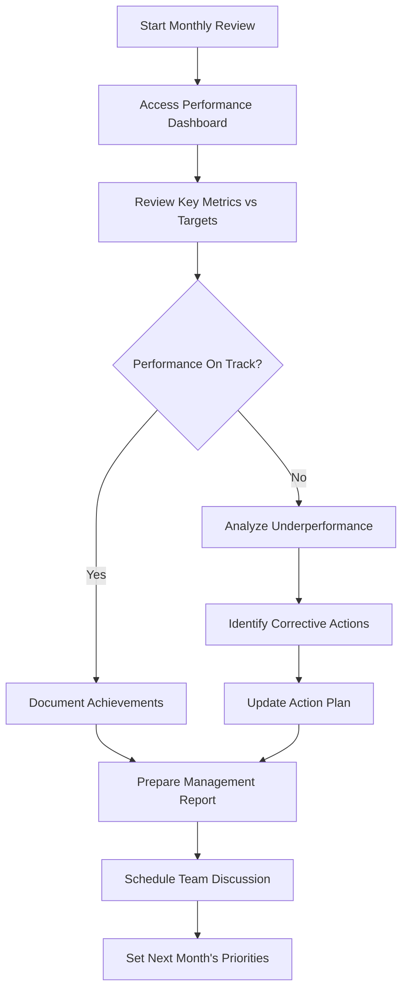
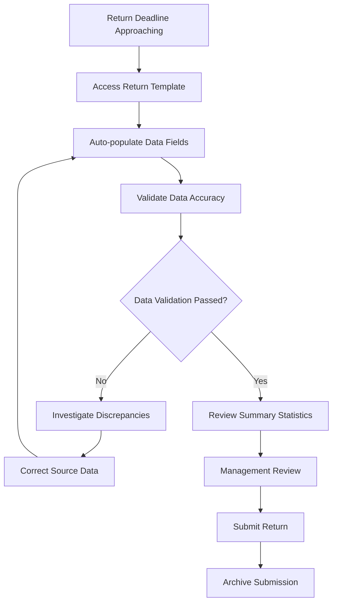
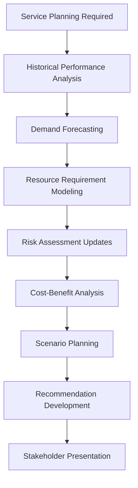

# Reports and Analytics 

## What This Module Does for You

**Your data and reporting system:** The Reports and Analytics module in the Idox Public Protection System provides access to performance data, statistical reports, and management information. It enables you to generate reports on regulatory activities, track performance against targets, and extract data for analysis.

**Why it matters to your service delivery:** This module helps you monitor service performance, prepare management reports, complete statutory returns, and analyze trends in regulatory activity. It provides the data you need to demonstrate service impact and make informed decisions.

**Key benefits:**
- **Performance tracking** - Monitor service performance against targets and objectives
- **Statistical reporting** - Generate reports on regulatory activities and outcomes
- **Data analysis** - Extract and analyze data to identify trends and patterns
- **Management information** - Provide data for management reporting and decision making
- **Statutory returns** - Support completion of required government returns

## Quick Start Guide

### Your First Day with Reports and Analytics
1. **Access the module**: Click "Reports" from the main navigation menu
2. **Explore available reports**: Review the different types of reports available
3. **Learn report generation**: Understand how to generate and customize reports
4. **Check data sources**: Understand what data is available for reporting
5. **Practice basic reports**: Generate some simple reports to familiarize yourself with the system

### Essential Daily Tasks Checklist
- [ ] Check dashboard for any red alerts or performance issues
- [ ] Review yesterday's activity summary
- [ ] Check progress against monthly targets
- [ ] Look for any unusual patterns in complaints or inspections
- [ ] Update any manual data inputs (if required for your role)

## Common Workflows

### Workflow 1: Monthly Performance Review

#### Step-by-Step Monthly Review Process:

##### Step 1: Performance Dashboard Review
- **Navigate to**: Reports → Performance Dashboard → Monthly View
- **Key metrics to review**:
  - Inspection completion rates vs target
  - Complaint response times vs SLA
  - Enforcement action effectiveness
  - FHRS ratings distribution
  - Resource utilization rates
- **Status indicators**: Green (on target), amber (at risk), red (off target)

##### Step 2: Detailed Analysis for Off-Target Metrics
- **Drill-down capability**: Click any red/amber metric for detailed breakdown
- **Time-series analysis**: Look at weekly trends within the month
- **Geographic analysis**: Check if issues are location-specific
- **Officer performance**: Review individual workloads and outcomes
- **External factors**: Consider seasonal influences, staff changes, policy updates

##### Step 3: Trend Identification and Pattern Recognition
- **Compare with previous months**: Use trend charts to identify patterns
- **Seasonal adjustments**: Account for predictable seasonal variations
- **Correlation analysis**: Look for relationships between different metrics
- **Benchmark comparison**: Compare performance against other similar authorities (if available)

##### Step 4: Action Planning and Reporting
- **Root cause analysis**: Identify underlying reasons for performance gaps
- **Corrective actions**: Develop specific, measurable improvement actions
- **Resource implications**: Consider staffing, training, or system needs
- **Timeline setting**: Set realistic deadlines for improvement
- **Management reporting**: Generate summary report for senior management

### Workflow 2: Statutory Return Preparation (e.g., LAEMS Food Safety Return)

#### Step-by-Step Statutory Return Process:

##### Step 1: Return Preparation
- **Navigate to**: Reports → Statutory Returns → LAEMS Food Safety Return
- **Select period**: Choose the reporting year (typically April-March)
- **System validation**: Check data completeness warnings
- **Auto-population**: Most fields filled automatically from operational data

##### Step 2: Data Validation and Quality Checks
**Key validation checks for LAEMS return**:
- **Premises numbers**: Total registered food businesses matches system count
- **Inspection figures**: Planned vs completed inspections add up correctly
- **Risk categories**: Distribution of premises across A-E risk ratings
- **Enforcement actions**: Formal and informal actions match enforcement records
- **Sampling data**: Food and water samples align with laboratory records

##### Step 3: Exception Investigation
**Common discrepancies and solutions**:
- **Missing inspections**: Check for inspections not marked as "completed"
- **Date range issues**: Ensure inspections counted in correct reporting period
- **Categorization errors**: Verify premises classified correctly for return
- **Double counting**: Check for duplicate records or premises
- **Officer attribution**: Ensure inspections assigned to correct officers

##### Step 4: Management Review and Submission
- **Summary review**: Present key figures to service manager for validation
- **Narrative sections**: Complete any required commentary on service performance
- **External validation**: Cross-check with other data sources if available
- **Submission process**: Upload to government portal by statutory deadline
- **Documentation**: Archive submission details and supporting evidence

### Workflow 3: Service Planning Data Analysis

#### Service Planning Analysis Process:

##### Step 1: Historical Performance Deep Dive
- **Navigate to**: Reports → Strategic Analysis → Service Planning Dashboard
- **Multi-year trends**: Analyze 3-5 year patterns in key service areas
- **Seasonal patterns**: Identify predictable seasonal variations in demand
- **Resource correlation**: Link performance outcomes to resource levels
- **External factors**: Consider economic, demographic, and policy changes

##### Step 2: Demand Forecasting and Modeling
**Key analytical components**:
- **Demographic changes**: Population growth, age profile changes, economic development
- **Business growth**: New business registrations, sector changes, economic factors
- **Regulatory changes**: New legislation, policy changes, national initiatives
- **Complaint trends**: Analyze complaint patterns and predict future demand
- **Resource scenarios**: Model different staffing and budget scenarios

##### Step 3: Outcome and Impact Analysis
- **Risk reduction measurement**: Quantify public protection outcomes
- **Compliance improvement tracking**: Measure business compliance changes over time
- **Cost-effectiveness analysis**: Compare different intervention approaches
- **Return on investment**: Demonstrate value of regulatory interventions
- **Benchmark comparison**: Compare performance with similar authorities

## Real-World Scenarios

### Scenario 1: "The Concerning Trend Alert"

**Situation**: Your Monday morning dashboard shows a 40% increase in food hygiene complaints over the past 4 weeks, with no obvious single cause.

**Your analytical approach:**
1. **Immediate investigation**: Reports → Complaints Analysis → Trend Analysis
2. **Geographic clustering**: Use map view to identify if increases are location-specific
3. **Business type analysis**: Check if certain types of premises over-represented
4. **Seasonal comparison**: Compare with same period in previous years
5. **Correlation check**: Look for relationships with weather, events, or other factors

**System tools used**:
- **Real-time alerts**: Automated notification of unusual patterns
- **Interactive mapping**: Geographic visualization of complaint clusters
- **Drill-down analysis**: Detailed breakdown by premises type, location, complaint type
- **Comparative analytics**: Year-on-year and seasonal comparisons
- **Predictive modeling**: Forecast continued trend based on current data

**Possible actions based on findings**:
- **Targeted inspection campaign**: Focus on identified high-risk areas/business types
- **Media alert**: Warn public about identified food safety issues
- **Resource reallocation**: Shift inspection priorities based on risk analysis
- **Intelligence sharing**: Share findings with neighboring authorities

### Scenario 2: "The Budget Justification Request"

**Situation**: Finance team asking for evidence to support maintaining current regulatory service budgets for next year.

**Your evidence-building approach:**
1. **Impact quantification**: Reports → Impact Analysis → Public Protection Outcomes
2. **Activity demonstration**: Show volume and complexity of regulatory work undertaken
3. **Comparative analysis**: Benchmark against similar authorities and national averages
4. **Cost-benefit calculation**: Demonstrate return on investment in regulatory services
5. **Risk assessment**: Model potential consequences of service reduction

**Key metrics to present**:
- **Public protection outcomes**: Number of serious risks eliminated, businesses improved
- **Economic impact**: Value of trade protected, consumer detriment prevented
- **Efficiency measures**: Cost per inspection, complaint resolution times
- **Compliance rates**: Improvement in business compliance over time
- **Statutory compliance**: Meeting government targets and requirements

### Scenario 3: "The Service Improvement Planning Session"

**Situation**: Annual service planning meeting requires data-driven recommendations for improving regulatory effectiveness.

**Your analytical preparation:**
1. **Performance review**: Complete analysis of all service areas against targets
2. **Bottleneck identification**: Find constraints limiting service effectiveness
3. **Resource optimization**: Analyze current resource allocation efficiency
4. **Best practice identification**: Identify most effective intervention approaches
5. **Improvement options**: Model different service delivery scenarios

**Evidence package preparation**:
- **Current performance**: Comprehensive dashboard of all key metrics
- **Trend analysis**: Multi-year patterns and trajectory projections
- **Comparative data**: Performance against similar services and national benchmarks
- **Resource analysis**: Workload distribution, efficiency measures, capacity utilization
- **Outcome focus**: Link activity measures to actual public protection outcomes

## Integration with Other Modules

### How Reports Connect to Your Complete Service Picture

```mermaid
graph LR
    A[📊 Reports & Analytics] --> B[🏢 Premises Data]
    A --> C[🔍 Inspection Outcomes]
    A --> D[📞 Complaint Patterns]
    A --> E[📋 Licensing Performance]
    A --> F[⚖️ Enforcement Effectiveness]
    A --> G[📱 Mobile Usage Stats]
    
    B -->|Business intelligence and risk profiling| A
    C -->|Performance measurement and trend analysis| A
    D -->|Service demand and satisfaction monitoring| A
    E -->|Processing efficiency and compliance tracking| A
    F -->|Impact measurement and outcome tracking| A
    G -->|Efficiency and adoption monitoring| A
```

#### Data Integration Flows
- **Real-time updates**: All operational modules feed live data into reporting system
- **Automated aggregation**: System automatically calculates performance metrics
- **Cross-module correlation**: Identify relationships between different service areas
- **Historical preservation**: Complete audit trail of all performance data

#### Intelligence Generation
- **Pattern recognition**: Automated identification of unusual trends or clusters
- **Predictive analytics**: Forecasting future service demand and outcomes
- **Risk scoring**: Dynamic risk assessment based on multiple data sources
- **Performance benchmarking**: Comparative analysis against targets and peers

## Advanced Analytics Features

### Predictive Modeling
- **Demand forecasting**: Predict future inspection and complaint volumes
- **Risk prediction**: Identify premises likely to have compliance issues
- **Resource planning**: Model staffing requirements for different scenarios
- **Outcome prediction**: Forecast impact of different intervention strategies

### Geographic Intelligence
- **Heat mapping**: Visualize complaint, inspection, and enforcement patterns
- **Route optimization**: Identify efficient inspection routing opportunities
- **Demographic correlation**: Link service demand to population characteristics
- **Area profiling**: Understand different geographic area risk profiles

### Performance Optimization
- **Efficiency analysis**: Identify bottlenecks and improvement opportunities
- **Resource utilization**: Track officer productivity and workload balance
- **Cost-effectiveness**: Compare different approaches to achieving outcomes
- **Quality monitoring**: Track consistency and effectiveness across the service

## Troubleshooting

### Common Issue 1: "Dashboard metrics don't match my manual counts"

**Problem**: Performance dashboard showing different figures than manual calculations
**Diagnosis steps**:
- Check date ranges - dashboard vs manual calculation period
- Verify filtering criteria - are you comparing like-with-like?
- Review data definitions - ensure understanding of what's being counted
- Check for timing differences - when data was extracted vs when counted

**Solutions**:
1. **Standardize definitions**: Use system definitions rather than manual interpretations
2. **Sync timing**: Run dashboard and manual counts at same time
3. **Document methodology**: Record exactly how manual counts performed
4. **System training**: Understand how system categorizes and counts data
5. **Regular calibration**: Periodically check manual vs system counts for consistency

### Common Issue 2: "Statutory return figures seem wrong"

**Problem**: Government return data doesn't align with expectations or previous years
**Validation checklist**:
- Confirm reporting period dates are correct
- Check for changes in data definitions or classifications
- Verify all data sources included in calculations
- Review for any system changes affecting data capture

**Solutions**:
1. **Data tracing**: Follow specific figures back to source records
2. **Period comparison**: Check same period in previous year for context
3. **External validation**: Cross-check with other data sources where possible
4. **Documentation review**: Check for any policy or system changes
5. **Early submission**: Submit draft returns early for feedback where possible

### Common Issue 3: "Charts and graphs not displaying correctly"

**Problem**: Visual displays not showing data properly or missing information
**Technical checks**:
- Browser compatibility and version
- Data volume - too much data for visualization
- Filter settings - overly restrictive criteria
- Permission issues - access to underlying data

**Solutions**:
1. **Browser update**: Use latest version of supported browser
2. **Data sampling**: Use date ranges or filters to reduce data volume
3. **Filter review**: Check all filter settings for appropriate criteria
4. **Permission check**: Verify access rights to all required data sources
5. **Alternative formats**: Try different chart types or export options

## Tips and Best Practices

### Effective Dashboard Usage
- **Regular monitoring**: Check key dashboards daily for early problem identification
- **Drill-down discipline**: Always investigate unusual metrics rather than ignoring them
- **Context awareness**: Consider external factors affecting your metrics
- **Trend focus**: Look at patterns over time rather than single data points
- **Action orientation**: Use data insights to drive actual service improvements

### Quality Data Management
- **Source data quality**: Ensure operational data entry is accurate and timely
- **Definition consistency**: Use standardized definitions across all reporting
- **Regular validation**: Periodically verify automated calculations
- **Documentation**: Maintain clear documentation of all calculations and definitions
- **Training**: Keep staff updated on proper data recording practices

### Strategic Analysis Approaches
- **Outcome focus**: Prioritize measuring actual public protection outcomes
- **Comparative context**: Always compare performance against targets and benchmarks
- **Root cause analysis**: Look beyond symptoms to understand underlying causes
- **Resource correlation**: Link performance to resource availability and allocation
- **Evidence-based decisions**: Use data analysis to support all significant decisions

## FAQ

### Q: How often is the dashboard data updated?
**A**: Most operational data is updated hourly, with some complex calculations updated overnight. Real-time critical alerts are updated within minutes.

### Q: Can I create my own custom reports?
**A**: Yes, the system includes a report builder for creating custom reports. Training is available for advanced report creation, or IT can assist with complex requirements.

### Q: Why do my figures differ from other authorities?
**A**: Different authorities may use different definitions, reporting periods, or data sources. Always check methodology before comparing performance figures.

### Q: How do I get historical data from before the system was implemented?
**A**: Historical data migration varies by authority. Contact system administrator about availability of pre-system data and any manual data entry options.

### Q: Can I export data for use in external systems?
**A**: Yes, most reports can be exported in Excel, PDF, or CSV formats. Large datasets may require special export procedures or data manager assistance.

### Q: What should I do if I notice a significant change in performance metrics?
**A**: Investigate immediately using drill-down features, notify management if significant, document findings, and consider corrective actions if needed.

### Q: How do I set up automated report distribution?
**A**: Use Reports → Subscriptions to set up automated delivery of standard reports. You can specify recipients, frequency, and delivery format.

### Q: Can I see individual officer performance data?
**A**: Individual performance data availability depends on your role and organizational policy. Managers typically have access to team member performance data.

---