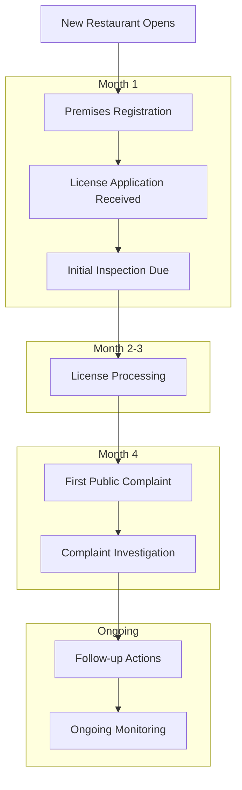
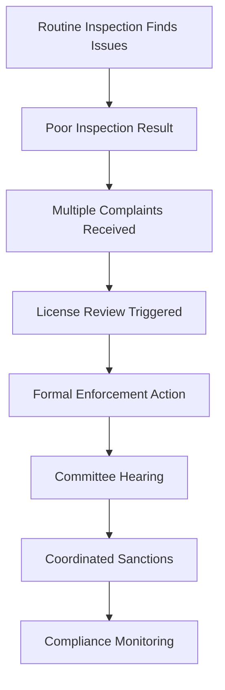
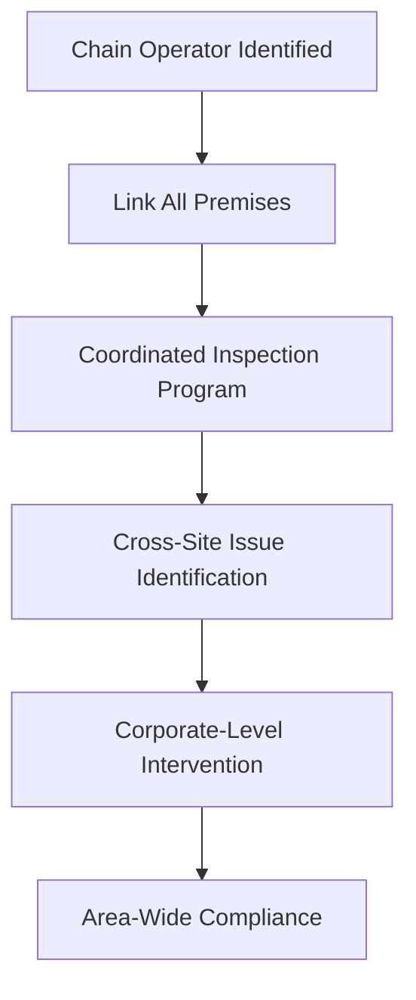

# End-to-End Regulatory Processes - Your Complete Workflow Guide

## What This Guide Does for You

**Integrated regulatory workflows:** This guide demonstrates how different modules in the Idox Public Protection System work together to handle complete regulatory cases. It shows you how premises records, inspections, complaints, licensing, and enforcement activities connect in real-world scenarios.

**Why this matters:** Regulatory work often involves multiple system modules and activities. Understanding how these connect helps you work more efficiently and ensures nothing falls through the cracks when managing complex cases.

## Complete Regulatory Scenarios

### Scenario 1: New Restaurant Opening - Complete Journey

This scenario follows a new restaurant from initial registration through first year of operation, showing how multiple modules interact across the complete Idox Public Protection System.

#### Phase 1: Business Registration and Setup (Month 1)

**What happens:** New restaurant "Bella Vista" submits food business registration

**Your workflow across modules:**

##### 1. Premises Management
- **Receive registration**: New food business notification received (may come via Online Food Business Registration left-hand menu)
- **Create premises record**: Click "Premises" icon → Left-hand menu "Create Premise" → Enter mandatory fields:
  - **Premises Name**: "Bella Vista Restaurant"
  - **Address**: Click search box, enter address details (use % wildcard if needed)
  - **Premises Type**: Select from dropdown (Building, Factory, Vehicle, etc.)
  - **Register for Food**: Check this box to create Food tab
- **Set food registration**: Click Food tab → Complete fields:
  - **Food Reg No**: Auto-generated unique reference
  - **Registration Date**: Date premises registered for food
  - **FH Main Usage Code**: Select primary food activity from dropdown
  - **Risk assessment**: System calculates risk based on business type and activities
- **Inspection scheduling**: System automatically creates inspection based on risk rating

##### 2. Licensing Integration
- **Check license requirements**: Click "Licensing" icon → Review if alcohol license needed for premises
- **Application submitted**: Premises license application received (appears in licensing work queue)
- **Link to premises**: Click "Licensing" → "Applications" → Select application → System automatically links to existing premises record using address matching
- **Consultation process**: System automatically sends consultation requests to:
  - Police (mandatory for alcohol licenses)
  - Fire Authority (mandatory for alcohol licenses) 
  - Environmental Health (internal consultation)
  - Other agencies as configured in Admin

##### 3. Initial Coordination
- **Combined approach**: Coordinate licensing consultation with food hygiene inspection
- **Information sharing**: Share premises details between licensing and food safety teams
- **Timeline management**: Align inspection timing with license application processing

#### Phase 2: License Processing and Initial Inspection (Month 2-3)

**Workflow coordination:**

##### 1. Food Safety Inspection (Inspections Module)
- **Pre-inspection prep**: Click "Inspections" icon → "My Inspections" → Select inspection → Review:
  - Premises record (click "Show Premise Info" button for overview)
  - Previous inspection history (left-hand menu "Inspections")
  - License application details (if linked)
- **Conduct inspection**: Use mobile device or desktop:
  - Select inspection form template
  - Complete inspection checklist systematically
  - Take photos with GPS and timestamp
  - Record findings in real-time
  - Calculate risk score using built-in tools
- **Inspection outcome**: System calculates rating = 4 (Generally Satisfactory) based on scores entered
- **Follow-up actions**: 
  - Generate inspection report automatically
  - Send advice letter using correspondence templates
  - Set re-inspection date (system suggests based on risk rating)
- **License implication**: Inspection results automatically visible to licensing team via shared premises record

##### 2. License Application Processing (Licensing Module)
- **Consultation responses**: Click "Licensing" → Select application → Check consultation responses:
  - Police = No objection (received via system)
  - Fire Authority = Conditions required (conditions specified in response)
- **Public representations**: Check representation period - no objections received during 28-day period
- **Officer assessment**: Click "Assessment" tab → Review:
  - Inspection results (linked from premises record)
  - Consultation responses and recommended conditions
  - Application details and supporting documents
- **Decision process**: 
  - Complete officer recommendation
  - Submit for authorization through system workflow
  - Add any additional conditions required
- **License issued**: 
  - Generate license document using system templates
  - License appears automatically on public register
  - Premises record updated with license details

##### 3. System Updates
- **Premises record**: Updated with inspection result and license details
- **Risk adjustment**: Risk level confirmed as Medium based on inspection
- **Monitoring setup**: Next inspection due in 12 months
- **Compliance baseline**: Clean start with minor issues noted for monitoring

#### Phase 3: First Public Complaint (Month 4)

**What happens:** Complaint received about food hygiene - "My family got food poisoning after eating there last night"

**Your response workflow:**

##### 1. Complaint Assessment (Complaints Module)
- **Receive complaint**: Click "Complaints" icon → New complaint appears in work queue
- **Immediate prioritization**: Set Priority = High (food poisoning complaints)
- **Premises lookup**: Click "Link to Premises" → Search for "Bella Vista Restaurant" → System automatically links complaint to premises record
- **History review**: Use left-hand menu to check:
  - "Inspections" - Review recent inspection results (4-star rating from 2 months ago)
  - "Complaints" - Check for any previous complaints against premises
  - "Actions" - Review any ongoing enforcement or follow-up actions
- **Risk assessment**: High priority + new business + food poisoning allegation = urgent investigation required

##### 2. Investigation Planning
- **Previous intelligence**: Click "Show Premise Info" button to review:
  - Last inspection score (4-star rating from 2 months ago)
  - Business type and risk factors
  - License status and conditions
- **Inspection scheduling**: Click "Inspections" left-hand menu → "Add" → Select "Unannounced Food Hygiene Inspection" → Set for immediate/next working day
- **Evidence requirements**: Plan to collect:
  - Photo evidence using mobile device camera
  - Food samples if available (link to Samples module)
  - Temperature recordings using mobile tools
- **Coordination**: Add "Action" to inform licensing team of serious complaint via left-hand menu "Actions"

##### 3. Investigation Execution (Inspections Module)
- **Unannounced inspection**: Use mobile app to document findings
- **Evidence gathering**: Poor temperature control found, inadequate cleaning
- **Sample collection**: If food available, create sample record via Inspections → Samples left-hand menu
- **Immediate action**: Voluntary closure agreed pending improvements
- **Documentation**: Detailed inspection report with photos and temperature readings
- **Communication**: Business informed of serious concerns, improvement plan required

#### Phase 4: Enforcement and Resolution (Month 5-6)

**Escalated response workflow:**

##### 1. Enforcement Considerations (Enforcement Module)
- **Assessment**: Significant deterioration since opening inspection
- **Action options**: Improvement notice vs informal action
- **Decision**: Serve Hygiene Improvement Notice (formal action)
- **Timeline**: Reasonable time for compliance
- **Legal preparation**: Document package prepared for potential prosecution
- **Notice creation**: Use Notices module to create and serve formal notice

##### 2. License Implications (Licensing Module)
- **License review**: Consider if license conditions breached
- **Committee referral**: Serious food safety issues = license review committee
- **Interim measures**: No immediate license suspension but enhanced monitoring
- **Documentation**: Compliance issues recorded against license
- **Booking management**: If license includes entertainment, check Bookings module for compliance

##### 3. Business Response Management
- **Improvement plan**: Business submits detailed improvement plan
- **Support provision**: Food safety training offered, guidance documents provided
- **Progress monitoring**: Weekly monitoring visits scheduled
- **Compliance deadline**: Clear deadline for all improvements

#### Phase 5: Resolution and Ongoing Monitoring (Month 7 onwards)

**Long-term management:**

##### 1. Compliance Achievement
- **Improvement verification**: Follow-up inspection confirms all improvements made
- **Standards achieved**: New inspection rating = 5 (Very Good)
- **Enforcement closure**: Improvement notice compliance achieved
- **License status**: License review withdrawn due to compliance

##### 2. Ongoing Monitoring Framework
- **Risk reclassification**: Premises risk increased to High temporarily
- **Enhanced inspection**: 6-month inspection frequency for next 2 years
- **Complaint monitoring**: Any future complaints flagged for immediate attention
- **License renewals**: Compliance history will be considered

##### 3. System Intelligence
- **Pattern recognition**: Monitor for any recurring issues
- **Performance tracking**: Business compliance trajectory tracked
- **Lessons learned**: Case study used for training new officers
- **Public confidence**: Complainant satisfaction with resolution process

### Scenario 2: Established Business Compliance Decline

This scenario shows how ongoing monitoring identifies problems and triggers coordinated regulatory response.

#### The Situation
"The Golden Lion" pub has operated successfully for 5 years but recent management changes have led to declining standards.

#### Month 1: Routine Inspection Reveals Problems

**Inspections Module Workflow:**
- **Scheduled inspection**: Annual inspection due based on premises history
- **Concerning findings**: 
  - Poor food hygiene standards
  - Unlicensed activities (live music without permission)
  - Fire safety issues
- **Inspection rating**: Drops from 4 to 2 (Improvement Necessary)
- **Immediate actions**: Informal advice given, re-inspection in 3 months

**Cross-Module Implications:**
- **Premises record**: Risk rating increased from Low to Medium
- **Licensing alerts**: Live music without variation flagged to licensing team
- **Enforcement consideration**: Inspection results trigger enforcement assessment

#### Month 2: Multiple Complaints Escalate Situation

**Complaints Module Workflow:**
- **Pattern emergence**: 3 separate complaints in 2 weeks
  - Food hygiene complaint with alleged food poisoning (link to Food Poisoning module if confirmed)
  - Noise complaints about unlicensed music
  - Complaint about underage drinking
- **Investigation coordination**: Single coordinated response rather than separate investigations
- **Intelligence gathering**: Pattern suggests systematic management failures
- **Accident recording**: If any injuries involved, create accident record via Accidents module

**Multi-Agency Response:**
- **Food safety**: Unannounced inspection finds continued poor hygiene
- **Licensing**: Investigation confirms unlicensed activities
- **Police liaison**: Underage drinking concerns shared with police licensing team

#### Month 3: Formal Regulatory Response

**Enforcement Module Coordination:**
- **Multi-stream enforcement**:
  - Hygiene Improvement Notice (food safety)
  - Licensing review application (unlicensed activities)
  - Fire safety enforcement referral
- **Coordinated timeline**: All actions coordinated to avoid conflicting requirements
- **Legal preparation**: Evidence gathered across all regulatory areas
- **Prosecution preparation**: If serious breaches, prepare prosecution case via Prosecutions module

**Licensing Module Actions:**
- **License review**: Application for review based on crime and disorder concerns
- **Committee referral**: Automatic committee consideration due to enforcement action
- **Interim steps**: Consider interim steps pending committee hearing

#### Month 4: Committee Hearing and Decision

**Committee Process:**
- **Comprehensive report**: Officer report covers all regulatory concerns
- **Evidence presentation**: 
  - Inspection reports and photos
  - Complaint details and investigation outcomes
  - Enforcement action details
- **Coordinated recommendations**: Single set of recommendations covering all issues

**Decision Implementation:**
- **License conditions**: Additional conditions imposed covering all concern areas
- **Warning issued**: Final warning about future compliance
- **Monitoring regime**: Enhanced monitoring across all regulatory areas
- **Review period**: 6-month review to assess improvement

#### Month 5-10: Coordinated Monitoring and Recovery

**Integrated Monitoring:**
- **Monthly visits**: Alternating between different teams but coordinated approach
- **Shared intelligence**: All findings shared across teams in real-time
- **Business support**: Training opportunities offered to help achieve compliance
- **Progress tracking**: Improvement trajectory monitored across all areas

**Successful Resolution:**
- **Standards improvement**: Gradual improvement across all areas
- **Complaint reduction**: No further complaints received
- **Compliance achievement**: All formal notices complied with
- **Risk reduction**: Premises risk rating returned to Low after 12 months

### Scenario 3: Multi-Premises Operator Management

This scenario shows how to manage a business operator with multiple premises locations using the complete system integration.

#### The Situation
"Fast Feast Ltd" operates 6 takeaway outlets across your area. Issues at one location reveal systematic corporate problems.

#### Corporate Intelligence Development

**Premises Module Coordination:**
- **Business identification**: Link all 6 premises to same corporate entity
- **Performance tracking**: Monitor compliance across all locations
- **Pattern recognition**: Identify common issues across premises
- **Resource planning**: Coordinate visits for efficiency

**Intelligence Sharing:**
- **Cross-premises learning**: Use findings from one premises to inform others
- **Corporate accountability**: Address issues at corporate level rather than site-by-site
- **Efficiency gains**: Single corporate meeting rather than 6 separate discussions

#### Coordinated Enforcement Response

**Multi-Site Enforcement:**
- **Simultaneous action**: Coordinated enforcement across all non-compliant sites
- **Corporate responsibility**: Hold company directors accountable for systematic failures
- **Consistent standards**: Ensure same standards applied across all locations
- **Shared solutions**: Corporate-wide training and system improvements

**License Coordination:**
- **Linked applications**: Review all licenses when issues identified
- **Corporate track record**: Consider performance across all sites
- **Coordinated conditions**: Apply consistent conditions across similar operations
- **Grant applications**: If business has received grants, review via Grants module for compliance
- **Planning applications**: Check Planning module for any development applications affecting premises

## System Efficiency Tips

### Cross-Module Data Flow
- **Single data entry**: Information entered once, available across all modules
- **Automatic updates**: Changes in one module automatically update related records
- **Shared intelligence**: All teams access same information for coordinated response
- **Complete audit trail**: Full history available regardless of which module you start from

### Workflow Optimization
- **Geographic working**: Plan visits by area across all regulatory functions
- **Coordinated communications**: Single point of contact for businesses with multiple issues
- **Shared evidence**: Photos and documents available to all relevant teams
- **Integrated reporting**: Combined reports for businesses with multiple regulatory relationships

### Performance Management
- **Cross-module targets**: Performance measures that span multiple regulatory areas
- **Resource efficiency**: Eliminate duplication of effort across teams
- **Customer satisfaction**: Consistent service experience across all regulatory interactions
- **Compliance outcomes**: Focus on overall business compliance rather than module-specific measures

## Advanced Integration Scenarios

### Major Incident Response
When serious incidents occur (e.g., food poisoning outbreak, major fire), the system coordinates:
- **Immediate response**: All relevant teams alerted simultaneously
- **Evidence preservation**: Automatic document and data preservation
- **Multi-agency coordination**: Shared information with external partners
- **Media management**: Consistent messaging across all regulatory aspects
- **Sample collection**: Systematic sample collection via Samples module
- **Accident recording**: Injury incidents recorded via Accidents module with RIDDOR assessment
- **Food poisoning tracking**: Cases managed via Food Poisoning module
- **Audit trail**: Complete activity logging via Audit Trail module

### Business Closure and Reopening
Complete workflow for managing business closures:
- **Closure recording**: Update status across all modules simultaneously
- **License implications**: Automatic consideration of license status
- **Enforcement tracking**: Monitor compliance with closure orders
- **Reopening assessment**: Coordinated evaluation before trading resumes

### Area-Based Regulation
Managing regulatory issues across geographic areas:
- **Problem identification**: Geographic analysis of complaints and non-compliance
- **Coordinated intervention**: Area-wide campaigns addressing common issues
- **Resource deployment**: Efficient allocation of inspection and enforcement resources
- **Community engagement**: Coordinated communication with local stakeholders
- **GIS mapping**: Use GIS module for spatial analysis and mapping of issues
- **Initiative management**: Coordinate area-wide initiatives via Initiatives module
- **Communications**: Use Communications Admin for consistent messaging

---

*This guide demonstrates how the Idox Public Protection System modules work together to deliver comprehensive, efficient regulatory services. The key to success is thinking beyond individual modules to complete regulatory outcomes.*